# Finance Tracker

An Obsidian plugin that logs spending as tagged bullets inside your daily notes,
keeps a running total, and turns those notes into spending, budget, holiday and
savings dashboards. Your markdown notes stay the source of truth — no database.

Support the project: [Buy Me a Coffee](https://buymeacoffee.com/tonyhad)

## First-time setup (empty vault)

On a fresh install the **setup wizard** opens automatically (or run the
**Run first-time setup** command / the button at the top of settings any time —
it never overwrites existing notes). It asks where your daily notes live, where
finance notes should be stored, your currency, and what to name the recurring
payments note (changeable later in settings) — then creates the starter notes
from templates embedded in the plugin:

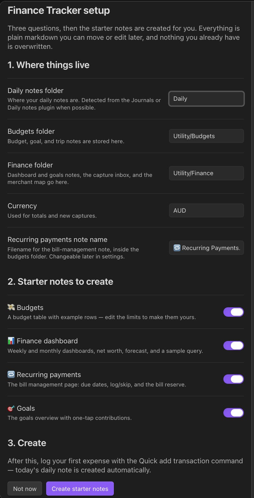

- `💸 Budgets.md` — the budget table
- `📊 Finance Dashboard.md` — weekly/monthly dashboards, net worth, forecast, a sample query
- `🔁 Recurring Payments.md` — the bill management page
- `🎯 Goals.md` — the goals overview with one-tap contributions

The manual path, if you prefer:

1. **Install & enable.** Copy this plugin to `.obsidian/plugins/finance-tracker/`,
   then Settings → Community plugins → enable **Finance Tracker**. (On mobile, turn
   on community plugins first.)
2. **Set two things** in the plugin's settings tab (Settings → Finance Tracker → Capture):
   - **Default currency** (e.g. `AUD`, `USD`).
   - **Daily notes folder** — point it at where you keep daily notes. Default is
     `Journal/Periodics/1. Daily`; the plugin routes captures to `<folder>/YYYY-MM-DD.md`
     (or `<folder>/YYYY/MM/YYYY-MM-DD.md` if you already use that structure).

   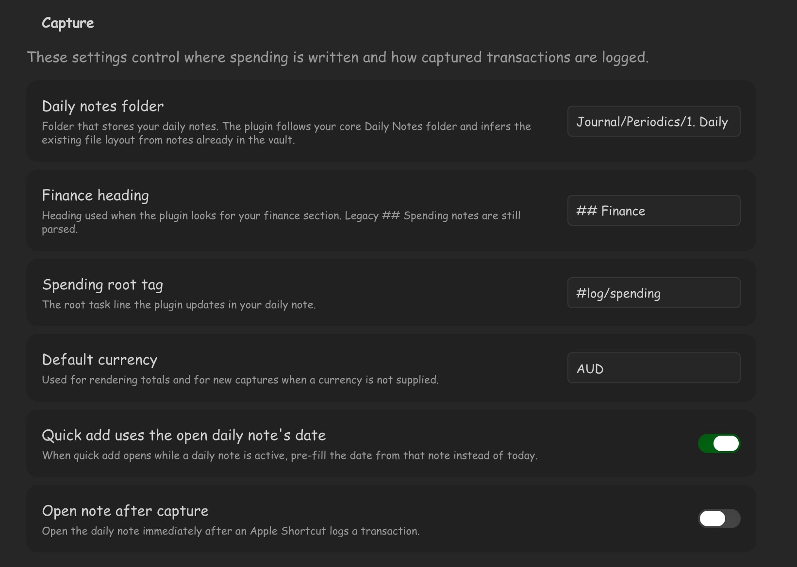
3. **Open the panel.** Click the **coin** ribbon icon (or run *Open daily budget*).
   This creates, on first run:
   - `Utility/Budgets/💸 Budgets.md` — a starter budget table you can edit.
   - `Utility/Finance/Inbox/` — the capture folder Shortcuts write to.
4. **Log your first transaction.** Run command **Quick add transaction**, type
   `12 coffee snacks`, press Enter. Today's note is created with a `## Finance`
   section and the entry; the panel and status bar update.
5. **Set your budgets.** Open `💸 Budgets.md` and edit the table rows to your own
   categories, limits and periods. Keep an `all` row for the overall bar + Left/Day.
6. **Add a dashboard (optional).** Put a ` ```finance-dashboard ` block (see
   [Dashboards](#dashboards)) in any note for charts and pace bars.
7. **Phone capture (optional but the point).** Pick the method that matches your sync
   (see [How logging works](#how-logging-works)): on **Obsidian Sync**, use a Shortcut
   that opens `obsidian://finance-capture?…` (no special storage needed); on an **iCloud
   Drive / Mac-local** vault you can instead drop capture files into your configured
   inbox folder. Step-by-step Shortcut recipes are in [How logging works](#how-logging-works) below.

Nothing else is required — daily notes, the budget note, and the inbox folder are
all created for you on demand.

## How logging works

Every transaction is a bullet under a `## Finance` heading in a daily note
(`…/YYYY/MM/YYYY-MM-DD.md`). The plugin maintains the checkbox total automatically:

```md
## Finance
- [ ] #log/spending 16.20
	- $12.00 #log/spending/food/restaurants
		- Nobu
	- $4.20 #log/spending/food/snacks
```

The same thing rendered in a real daily note:

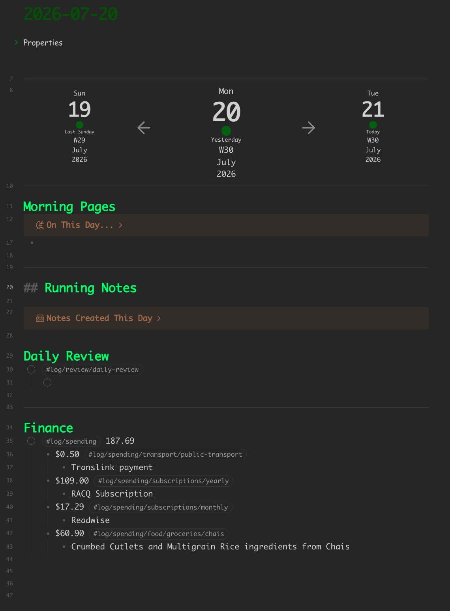

You rarely type this by hand. Four ways to log:

| Method | Use it for |
| --- | --- |
| **`obsidian://finance-capture` Shortcut** | phone capture with **any** sync (incl. Obsidian Sync); briefly opens Obsidian |
| **Apple Shortcuts → capture inbox file** | phone capture when the vault is **Files-writable** (iCloud Drive / Mac-local); no Obsidian launch |
| **Quick add modal** (command or status bar) | logging while you're in Obsidian |
| **Type the bullet yourself** | edge cases; the total self-heals on note open |

**Which phone method?** It depends on how the vault syncs:
- **Obsidian Sync** (the vault lives inside the Obsidian app) → use the **URL Shortcut**.
  Shortcuts can't write into Obsidian's sandbox, so the inbox-file method won't work on the phone.
- **iCloud Drive / Mac-local folder** → the **inbox-file** method is best (silent, no app launch),
  and the same folder lets Mac-side scripts and the in-app bank-CSV reconcile drop captures in.

### URL Shortcut (works with any sync)
A Shortcut opens `obsidian://finance-capture?amount=12.5&merchant=Coles&category=food/groceries&source=manual`.
The plugin logs it to today's note. This briefly foregrounds Obsidian but needs no filesystem access.

The URL method also works as an **automation** — no Save File step needed on an Obsidian Sync vault.
This is the actual automation used against an ANZ Plus card (`source=anz`): a **Transaction**
trigger set to Run Immediately —

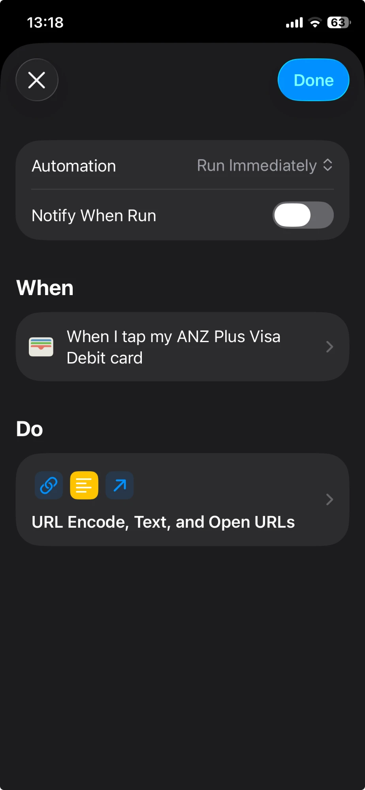

— followed by URL-encoding the merchant, building the `obsidian://finance-capture` URL, and opening it:

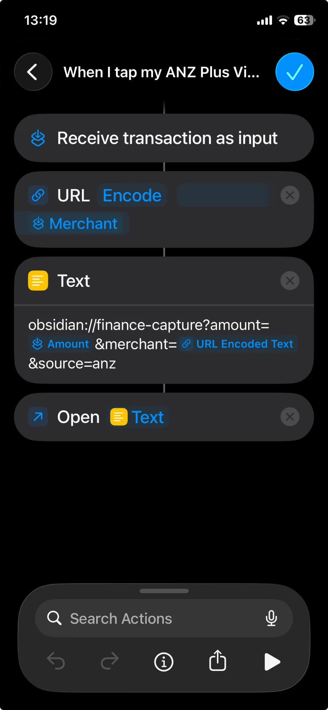

**Shortcut D — "Log + confirm in Obsidian"**: build an **Open URL** action —
`obsidian://finance-capture?vault=<vault>&amount=12.5&category=food/groceries&merchant=Coles&source=manual` —
and run it from the Home Screen, Lock Screen, or Action Button. This is the only phone method that
works on an Obsidian Sync vault; use it whenever you want the dashboard to update immediately.

### Capture inbox (Files-writable vaults)
A Shortcut (or Mac script, or the bank-CSV reconcile) drops a one-line file into the
inbox folder (default `Utility/Finance/Inbox/`); the plugin drains it into the right daily
note on arrival and on launch. Capture line format — one line, `key=value` pairs separated by ` | `:

```
amount=12 | cat=food/restaurants | merchant=Nobu | date=2026-06-10 | cur=AUD | source=apple-pay
```

| Key | Meaning |
| --- | --- |
| `amount` (`amt`, `total`) | the amount to log — the only required key |
| `cat` (`category`) | category path, e.g. `food/groceries`. Omit to log as `uncategorized` and categorise later. |
| `merchant` (`payee`, `name`) | shown under the entry; also used to auto-guess the category from the merchant map |
| `date` | `YYYY-MM-DD`; defaults to today. Set it for retroactive logging — the plugin routes to that day's note. |
| `cur` (`currency`) | currency code; defaults to your vault default |
| `origamt` / `origcur` | foreign amount + currency (travel); the holiday dashboard converts it |
| `source` | free text, e.g. `apple-pay`, `wise`, `manual` |
| `id` (`wiseid`, `ref`) | external id for de-duplication (used by Wise sync / CSV reconcile) |

Bad files are moved to `Inbox/_failed/` with the error, never dropped.

**Shortcut A — "Log Spend" (manual, everyday)** — put it on the Home Screen, Lock Screen, Action
Button, and "Hey Siri, log spend":
1. **Ask for Input** → *Number* → "Amount?"
2. **Choose from Menu** → your categories + "Skip".
3. **Ask for Input** → *Text* → "Merchant?" (allow empty).
4. **Text** action: `amount=[Provided Input] | cat=[Menu Result] | merchant=[Text] | date=[Current Date · yyyy-MM-dd] | source=manual`
   (leave `cat=` empty if "Skip" was chosen).
5. **Save File** → iCloud Drive → the inbox folder → "Ask Where to Save" **off**, "Overwrite" **off**.
   Filename: `[Current Date · yyyy-MM-dd'T'HHmmss]-[Random 4 chars].txt`.

**Shortcut B — "Log Apple Pay" (automation, the important one)** — for a card you don't sync via
Wise: Shortcuts → **Automation** → **Transaction** trigger, filtered to that card, **Run Immediately**.
Build the same **Text** line from `Transaction Amount` / `Transaction Merchant`, leave `cat=` empty
(it auto-guesses from the merchant map or lands as `uncategorized`), add `source=anz`, then **Save
File** to the inbox as above. Every tap-to-pay now auto-logs with zero interaction. Don't also make
an Apple Pay automation for a card that's covered by Wise sync (below) — that would double-log it.

**Shortcut C — "Log Spend (pick date)"** — same as Shortcut A plus an **Ask for Input → Date** step
feeding `date=`, for backfilling a day you forgot.

### Wise sync (covers all Wise spending, with real FX)
Wise personal API tokens support **balance statements**, so a scheduled Shortcut can pull every Wise
transaction — card, online, transfers — including the real exchange rate for foreign spends. Keep
the token in the Shortcut, never in the vault (generate it in Wise → Settings → API tokens; rotate
or revoke it there if needed).
1. **Get Contents of URL** → `GET https://api.wise.com/v1/profiles`, header `Authorization: Bearer <token>` → `profileId`.
2. **Get Contents of URL** → `GET /v4/profiles/{profileId}/balances?types=STANDARD` → `balanceId` per currency.
3. **Get Contents of URL** → `GET /v1/profiles/{profileId}/balance-statements/{balanceId}/statement.json?currency=AUD&intervalStart=<lastSync>&intervalEnd=<now>&type=COMPACT`.
4. For each activity newer than the last sync, **Save File** one inbox file: `amount=<spend> | merchant=<details> | date=<YYYY-MM-DD> | cur=AUD | source=wise | id=<referenceNumber>` (add `origamt=`/`origcur=` for foreign spends).
5. Store `lastSync` and schedule the Shortcut nightly. The `id=` field means re-runs never double-log.

### ANZ Plus reconcile (catch what Apple Pay missed)
The Apple Pay automation only sees in-person taps — not online, direct debits, or BPAY. Monthly,
export the bank CSV and run **Reconcile bank/Wise CSV against logged spending**; unmatched charges
can be sent to the capture inbox. Matching is by date+amount, so already-logged taps aren't duplicated.

### Deferred categorisation
Capture is instant and dumb; categorisation is a quick daily review. Anything logged as
`uncategorized` (or auto-guessed wrong) can be fixed from the sidebar's **Needs a Category** triage
list or the daily note directly. Tick "remember this merchant → category" while fixing one and
future captures from that merchant categorise themselves (see [Merchant map](#merchant-map)).

### Quick add modal
Command **Quick add transaction** (bind a hotkey) or click the status bar. One field,
natural language, live preview:

```
12 nobu restaurants        $8 #transport Lime        4.50 coffee snacks @yesterday
```

First number = amount · a `cat/sub`, `#tag` or known category word = category ·
`@date` (ISO, `yesterday`, weekday, or anything the Natural Language Dates plugin parses) ·
the rest = merchant.

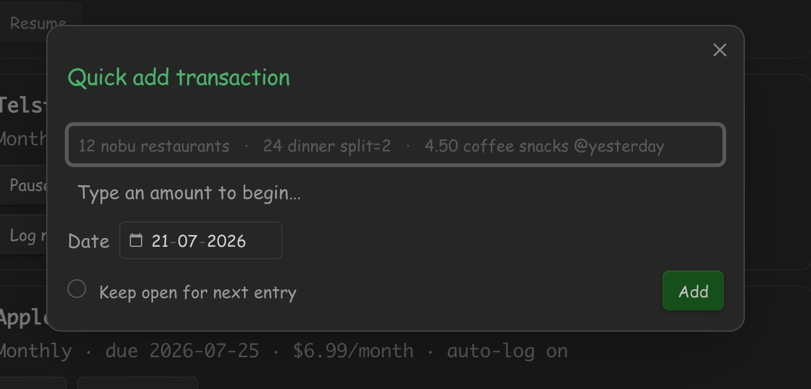

**Autocomplete** — as you type, suggestions appear for **categories**,
**merchants**, and **people** (`owed=…`), all derived from what you have
actually logged plus your budget table — there is no category list to maintain.
Arrow keys cycle, **Tab** or **Enter** accepts the highlighted suggestion, **Esc**
dismisses. Once no suggestions are showing, **Enter** submits the entry — so
typing a full line is just Enter-Enter-Enter through each token, finishing on
a plain Enter with the popup closed. Accepting a known merchant also fills in
its remembered category.

**Date from the open note** — with the *Quick add uses the open daily note's
date* setting on (off by default), opening quick add while a daily note is
active pre-fills that note's date, so backfilling an old day is frictionless.

## Tag language

| Kind | Tag | Example bullet |
| --- | --- | --- |
| Spending | `#log/spending/<category>[/<sub>]` | `- $12 #log/spending/food/restaurants` |
| Income | `#log/income/<key>` | `- $2400 #log/income/salary` |
| Savings contribution | `#log/income/<goalKey>` | `- $500 #log/income/japanmidyear` |
| Savings withdrawal | `#log/spending/goal/<goalKey>/<category>` | `- $90 #log/spending/goal/rainy-day/medical` |
| Holiday spend | `#log/spending/<year>/<key>/<category>` | `- $40 #log/spending/26/japanmidyear/food` |
| Recurring bill | `#log/spending/subscriptions/<cadence>/<name>` | `- $12.99 #log/spending/subscriptions/monthly/spotify` |
| Owed share (child line) | `#log/owed/<person>` | `	- owes: Sam $8.00 #log/owed/sam` |
| Balance snapshot | `#log/balance/<account>` | `- $5,230.00 #log/balance/anz-plus` |

The amount is a `$`-prefixed number on the bullet; a child line is the merchant, a
second child is a note. Categories are slash paths (`food/restaurants`).

Because every entry is just a tag, Obsidian's own tag pane doubles as a category
browser — nested paths become a real tree, with a live count per level:

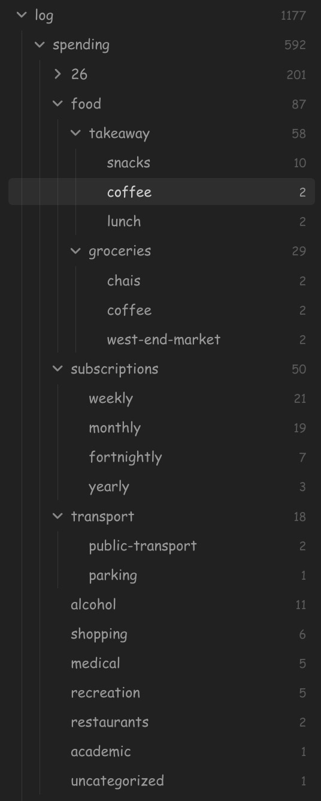

## Budgets

Budgets are a markdown table in `Utility/Budgets/💸 Budgets.md`:

```md
| Name         | Category   | Limit | Period | Currency |
| ------------ | ---------- | ----: | ------ | -------- |
| Groceries    | groceries  |   140 | week   | AUD      |
| Shopping     | shopping   |   200 | month  | AUD      |
| All Spending | all        |   250 | week   | AUD      |
```

A real budgets note, with the free-form Notes section people tend to add below the table:

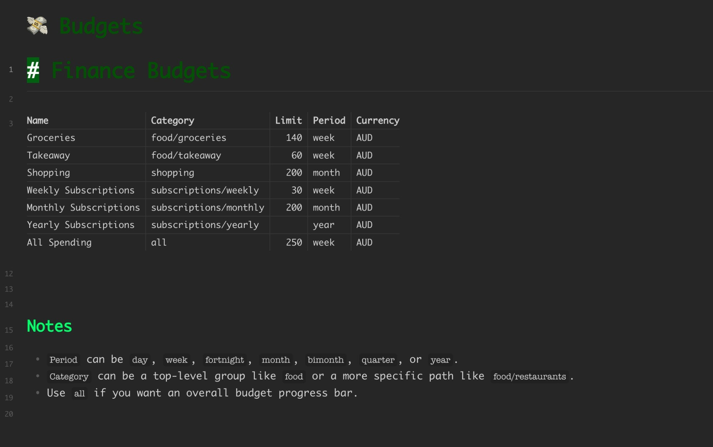

- **Category** is a top-level group (`food`) or a path (`food/restaurants`); `all`
  budgets everything.
- **Period**: `day`, `week`, `fortnight`, `month`, `bimonth`, `quarter`, `year`.
  Limits scale by calendar days when shown over a different range (a weekly $140
  shows as ~$600 on a monthly dashboard).
- Bars are **pace-aware**: a marker shows where you should be today, the colour
  reflects whether you're ahead of pace (not just over the cap), and each bar
  shows the projected end-of-period spend and a safe `$/day` for the days left.
- An `all` budget also drives the **Left / Day** card and the daily-spend trend line.
- **Trip-tagged spending never counts toward home budgets.** An entry like
  `- $40 #log/spending/26/japan/shopping` is a withdrawal from that trip's
  savings goal: it shows on the holiday dashboard and reduces the goal, but is
  excluded from regular budgets, dashboards, the sidebar totals, and the
  forecast. Use `type: all` in a `finance-query` block for a report that
  includes trip entries.

## Dashboards

Add a fenced code block to any note; each reads transactions from your daily notes.

````md
```finance-dashboard
period: week        # day | week | fortnight | month | bimonth | quarter | year
groupBy: primary    # primary | full
currency: AUD       # optional override
start: 2026-06-01   # optional explicit range (needs end)
end: 2026-06-30
title: June Spending
```
````

Shows summary cards (total, avg/day, vs previous period, top category), a
**two-ring category donut** — inner ring is the major categories, outer ring is
every subcategory as a shade of its parent's hue, with a nested legend — a
daily-spend sparkline with your budget line, pace-aware budget bars, and
savings activity. Export CSV from the header. (The sidebar's mini pie stays at
major categories; the donut falls back to a flat pie when nothing has
subcategories.) Subcategory shades are ranked by spend — the biggest subcategory
in a group gets the lightest shade of that hue, the smallest the darkest — and
hovering any slice shows its name, amount, and share of the total.

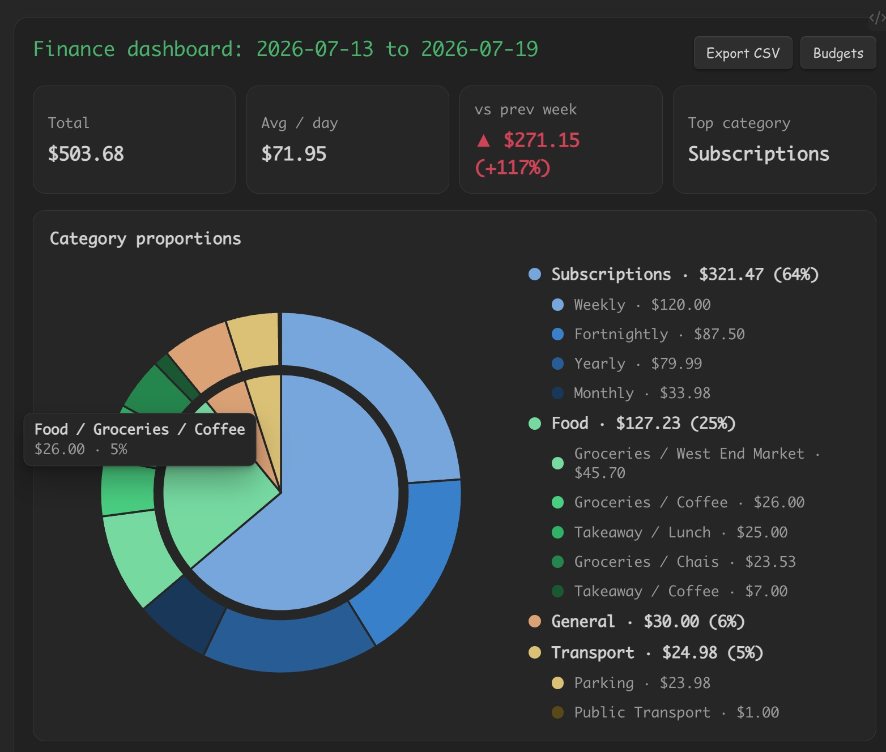

`holiday-dashboard` — planned vs actual trip spend, per-day budget remaining, and a
trip calendar. Reads a goal note that has a `trip_tag` (see [Goals](#goals-savings--trips)),
plus its Planned/Allocated tables. **Once the trip has ended** (past `end_date`,
or the note is archived) the same block automatically becomes a **trip
reflection**: total and after-trip spend, how it landed against the budget,
average per day, biggest and quietest days, a per-category table (total, avg/day,
share, and the biggest single expense with its merchant), a spend-by-day chart,
and planned-vs-paid. Force either mode with `view: live` or `view: reflection`.

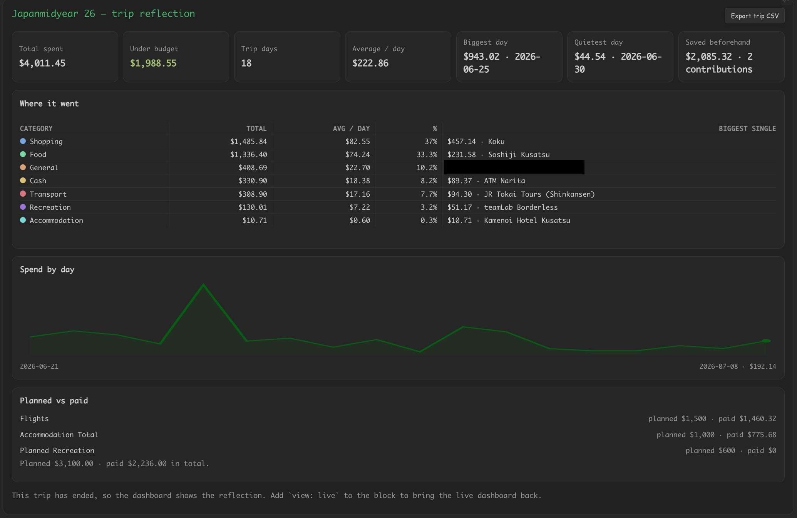

`savings-dashboard` — per-goal progress, contributions, sinking-fund set-aside and
pace. Reads a goal note (frontmatter `goal_key`, `target_amount`, `due_date`, …).

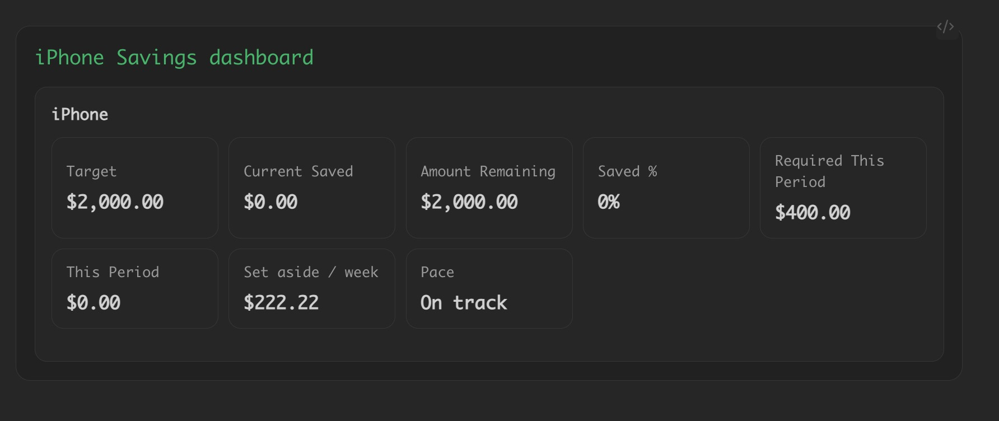

Every chart shares one **hue-family colour system**: each major category gets a
base hue, its subcategories render as lighter/darker shades of that hue, and
pies and legends rank by major-group total with subgroups nested beneath.

These defaults — grouping, the pie label threshold, week start, and the budget
check period — live in Settings → Dashboard:

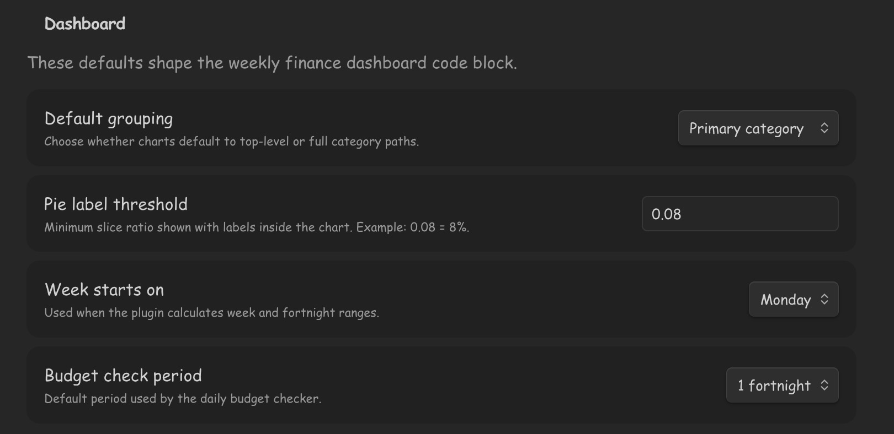

## Goals (savings + trips)

Savings goals and holiday budgets share **one frontmatter schema**. Any goal with
`target_amount` and `due_date` automatically shows sinking-fund math — the
set-aside needed per week and whether you're ahead of or behind the linear pace.
A holiday is simply a goal that also has a `trip_tag`, dates, and a currency.
Command: **Create savings goal** (or the buttons in settings).

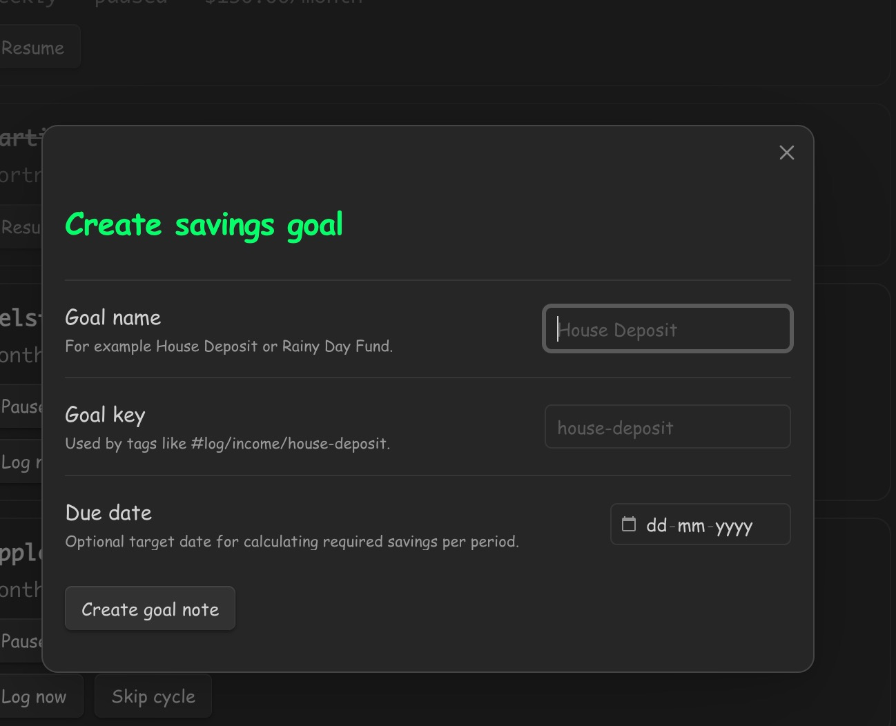

```md
---
goal_name: Roadbike
goal_key: roadbike
target_amount: 3000
starting_balance: 0
due_date: 2026-12-10
active: true
currency: AUD
---

```savings-dashboard
```
```

A trip goal adds the trip keys (and optionally `trip_currency` for trip-mode capture):

```md
---
goal_name: Japan Mid-Year
goal_key: japanmidyear
target_amount: 6000
due_date: 2026-06-18
trip_tag: 26/japanmidyear
trip_currency: JPY
start_date: 2026-06-21
end_date: 2026-07-08
total_budget: 6000
currency: AUD
exchange_rates: JPY=0.00877
---
```

Contributions are `- $500 #log/income/roadbike` bullets; withdrawals are
`- $90 #log/spending/goal/roadbike/<category>`. The legacy `goal_key` /
`holiday_tag` frontmatter still parses, so un-migrated notes keep rendering.

### Contributing to goals

Command: **Contribute to savings goal** (also the Contribute buttons in the
goals block below)

Logs a contribution bullet — `- $150.00 #log/income/roadbike` — into the chosen
day's note. Contributions are **virtual envelopes**: nothing requires a real
bank transfer, so this works whether each goal has its own account or every
goal lives inside one lump-sum savings account.

### Goals overview block

Command: **Insert goals block**

````md
```finance-goals
account: short-term-savings   # optional — reconcile against a real account
```
````

One card per goal: saved vs target, the weekly set-aside still needed,
ahead/behind pace, and a **Contribute** button. With `account:` it compares the
sum of your goal envelopes against that account's latest `#log/balance/…`
snapshot and shows the **unallocated** remainder — the piece of the lump sum
not yet promised to any goal (or a warning when you've over-allocated).

### Multiple holidays & archiving

Commands: **Archive finished holidays** · **Archive completed savings goals**
(or the per-note toggles and Archive buttons in Settings → Holiday budgets)

You can save for **several holidays at once** — every goal note with
`active: true` shows in the sidebar and counts toward forecast set-asides, and
capture routes to whichever trip's dates match.

When a trip is over — or a savings goal has hit its target — archive it.
Archiving writes a frozen **Archive summary** into the note: the savings steps
(every contribution, dated), withdrawals, and for trips how the money was
spent during the trip and after its end date. The note is then marked
`archived: <date>` and moved to the archive folder. The note keeps its full
history and its dashboards still render when you open it, but it leaves the
active set: no more capture routing, sidebar cards, or forecast set-asides.

```md
## Archive summary (2026-07-25)

- Target: $3,500.00
- Saved: $3,500.00 (100% of target) — $500.00 starting balance + 2 contributions

### Savings steps

| Date       |    Amount | Note             |
| ---------- | --------: | ---------------- |
| 2026-05-01 | $1,500.00 | Savings transfer |
| 2026-06-01 | $1,500.00 | Savings transfer |

### How it was spent

- Trip budget: $3,500.00
- Spent during the trip: $2,914.00 across 41 entries
- Spent after 2026-07-24: $40.00 across 1 entry
```

## Recurring payments

Command: **Log due recurring payments** · **Insert recurring payments block**

Tag a bill once with a cadence subtag under the recurring prefix (default
`subscriptions`; configurable in settings) and it becomes a tracked recurring
payment. The amount is inferred from the last logged entry, and next-due from
the last logged date plus the cadence (`weekly`, `fortnightly`, `monthly`,
`quarterly`, `yearly`):

```md
## Finance
- [ ] #log/spending 31.49
	- $12.99 #log/spending/subscriptions/monthly/spotify
		- Spotify
	- $18.50 #log/spending/subscriptions/weekly/gym
		- Anytime Fitness
```

Then drop this block into any note:

````md
```finance-recurring
```
````

It shows upcoming bills, overdue items with a one-tap **Log now**, the total
due in the next 30 days, and the cost per month and per year. An optional
setting (**Auto-log recurring payments**) logs each item automatically on its
due day.

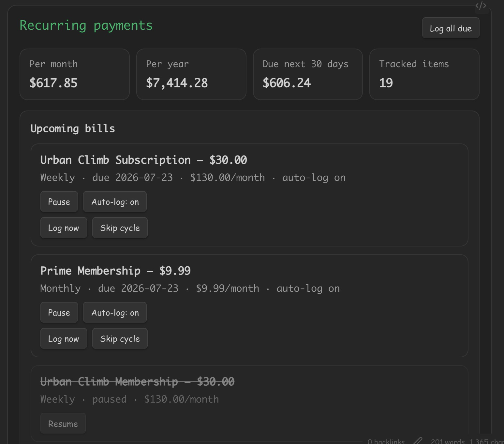

**Managing bills** — command **Open recurring payments note** creates a
management page (a normal note with a `manage: true` block). In manage mode
every item gets **Log now**, **Skip cycle** (logs a $0 entry on the due day,
so the schedule moves on but the price is remembered), **Pause**, **Auto-log**,
and **Edit**. The block also has a **Bill reserve** section: the sinking fund
for bills. It shows how much should already be set aside (each bill accrues
day by day since it was last paid — half a year after an annual bill, half its
cost should be reserved) and the steady per-week / per-month set-aside that
keeps every cadence covered.

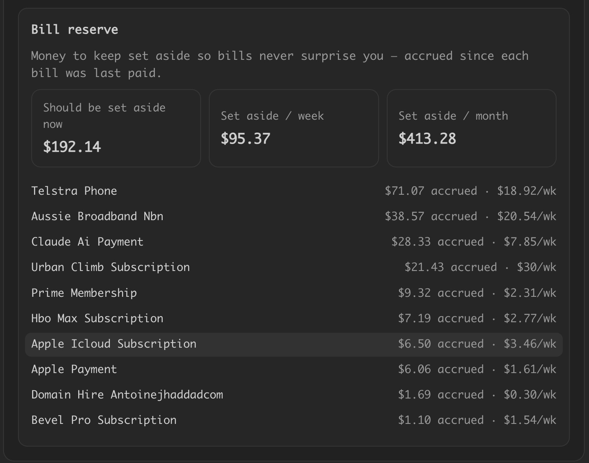

**Pausing, archiving, and removing a bill** — **Pause** moves a bill straight
into a collapsed **Archived** section at the bottom of the block (click to open
it) — it stops counting toward totals, the bill reserve, and auto-logging, but
its history stays intact. From Archived you can **Resume** it, or **Remove
completely**, which drops it from consideration for good — even if you log
another entry with the same tag later, it won't resurface. Archived/removed
bills never appear in Settings → Recurring payments; that list only shows
current bills, as a scrollable checkbox table (Current / Auto-log columns,
header pinned while you scroll).

**Editing a bill** — **Edit** (manage mode) lets you correct the amount
directly, or schedule a future price change with an exact date (e.g. "this
subscription becomes $15.99 on the 1st") — the new amount applies itself
automatically once that date arrives, and until then the block shows
"changing to $X on `<date>`" next to the bill.

Manage mode with a scheduled price change (Aussie Broadband Nbn, "changing to
$66.50 on 2026-08-15") and the Archived section expanded, showing Resume and
Remove completely:

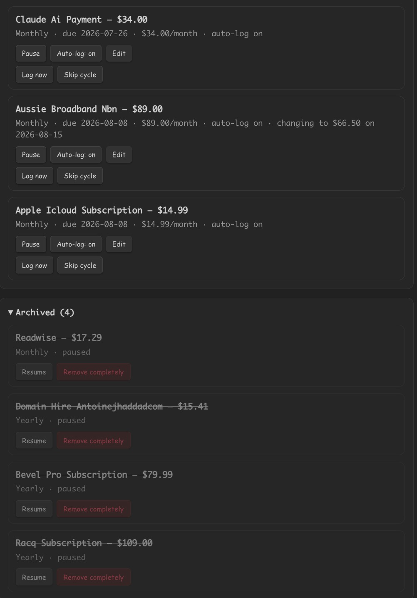

Settings → Recurring payments — current bills only, as a scrollable checkbox
table with the header pinned while you scroll:

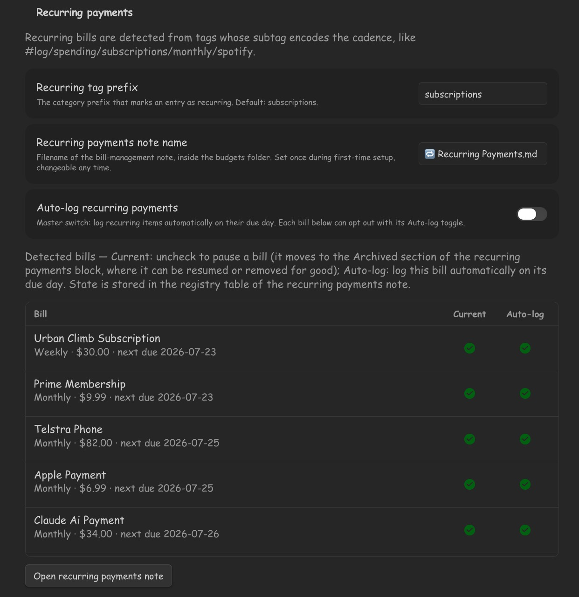

**The registry** — per-bill state lives in a hand-editable table in the
recurring payments note (the source of truth; the checkboxes in settings and
the manage block just write to it):

```md
## Registry

| Item    | Cadence | Amount | Active | Auto-log | Next Amount | Change Date |
| ------- | ------- | -----: | ------ | -------- | -----------: | ----------- |
| spotify | monthly |  12.99 | yes    | yes      |        15.99 | 2026-08-01  |
| gym     | weekly  |        | no     |          |              |             |
```

Set **Active** to `no` to pause a cancelled bill. **Auto-log** opts a bill in
or out of the automatic due-day logging (the master switch is in settings). A
filled **Amount** overrides the inferred price. **Next Amount** + **Change
Date** schedule a future price change. Blank cells keep the defaults; older
notes with the 5-column table are widened automatically the first time a bill
is edited.

**Where the note lives** — the recurring payments note's filename (inside your
budgets folder) is a setting: asked once during first-time setup, changeable
any time in Settings → Recurring payments → "Recurring payments note name".

## Split expenses

Command: **Settle up split expenses** · **Insert split expenses block**

Quick-add and `obsidian://finance-capture` accept `split=N` (even split — your
share is amount ÷ N) and `owed=Name:$X` tokens:

```
24 nobu restaurants split=2          → you owe $12, someone owes you $12
30 dinner restaurants owed=Sam:$10   → Sam owes $10 of the $30
```

The full amount stays on the bullet, with a hand-editable child line per person.
Only **your share** counts toward budgets:

```md
	- $24.00 #log/spending/food/restaurants
		- Nobu
		- owes: Sam $12.00 #log/owed/sam
```

The ` ```finance-splits``` ` block and a sidebar card sum outstanding balances
per person. **Settle up** logs the repayment as income
(`- $12.00 #log/income/settleup/sam`) and appends `· settled <date>` to the owed
lines.

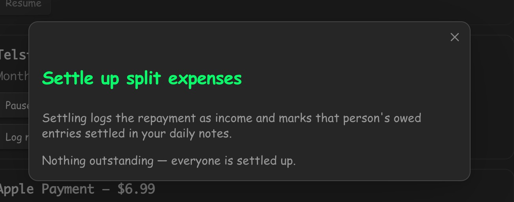

## Trip mode

Commands: **Start trip** · **End trip**

Start trip picks a trip goal note and, until you end the trip, quick-add and URL
captures default to the trip tag — and to the trip currency when `trip_currency`
is set, converting to your home currency through the note's stored exchange
rates. The sidebar shows spent-today, trip budget remaining, and a safe $/day
for the days left.

## Forecast

Command: **Insert forecast block**

````md
```finance-forecast
months: 6
```
````

Projects recurring income, minus recurring bills, minus your trailing-90-day
average discretionary spend, forward N months — including committed goal
set-asides — as a line chart with a `~$X by <date>` headline. Override any
input with `income:`, `bills:`, `discretionary:`, `setaside:`, or `start:`.

## Net worth

Command: **Snapshot balances** · **Insert net worth block**

Snapshot balances logs one bullet per account into today's daily note (accounts
you've snapshotted before are pre-filled):

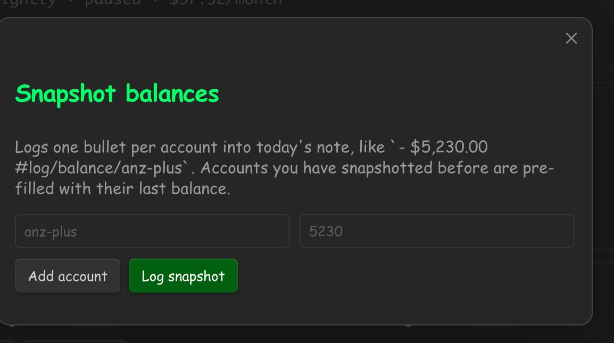

```md
- $5,230.00 #log/balance/anz-plus
- $812.40 #log/balance/wise
```

The dashboard renders the balance trend from those bullets — no extra files:

````md
```networth-dashboard
```
````

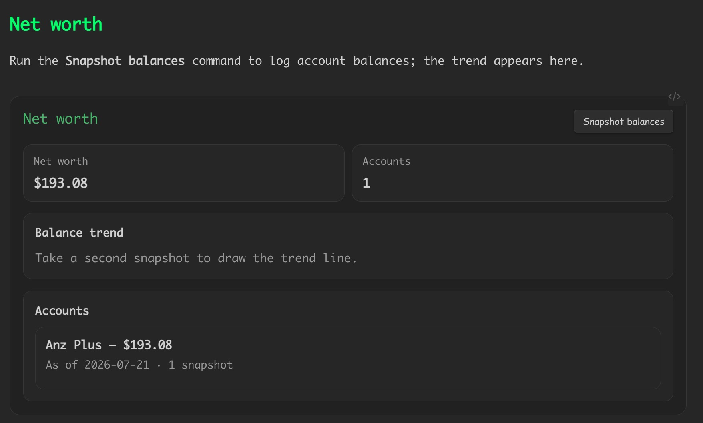

## Query block

Command: **Insert finance query block**

A read-only report over your entries — filter by category, tag, merchant, or
date range; group by category, merchant, or month; sum or count:

````md
```finance-query
period: month        # or start: / end: dates
category: food       # optional prefix filter
merchant: nobu       # optional substring filter
type: spending       # spending | income | all
group: category      # category | category-full | merchant | month | none
op: sum              # sum | count
view: table          # table | categories | bars | income-expense | cumulative
```
````

Views: `table` (grouped sums), `categories` (ranked category table with
percentages), `bars` (ranked bars), `income-expense` (monthly income-vs-expense
bars), `cumulative` (cumulative balance line).

## Year & quarter reviews

Commands: **Insert yearly review** · **Insert quarterly review**

Unlike every other `Insert ___ block` command, these don't insert a live code
block — they compute the numbers once, right now, and insert the finished
markdown at your cursor. Run one inside a "Yearly Review" or "Quarterly
Review" note (or any note) to drop in a frozen snapshot for the current
year/quarter: total spent and income, the best and worst month by spend, the
top spending categories with their share of the total, and a transfers
summary (savings contributions, savings withdrawals, and settled split
repayments received). Re-running the command later produces a fresh snapshot
reflecting whatever you've logged since.

```md
## 2026 Year in Review

- Period: 2026-01-01 to 2026-12-31
- Total spent: $18,240.55
- Total income: $64,000.00
- Best month (lowest spend): 2026-02 — $980.10
- Worst month (highest spend): 2026-07 — $4,011.45

### Top spending categories

| Category | Total | % of spend |
| --- | ---: | ---: |
| Food | $5,120.30 | 28% |
| Subscriptions | $2,890.00 | 16% |

### Transfers

- Savings contributions: $3,000.00 (4)
- Savings withdrawals: $250.00 (1)
- Settled repayments received: $120.00 (2)
```

## Daily Budget sidebar & status bar

The **Daily Budget** sidebar (ribbon coin icon) shows today + period spend, a
Left/Day card, a mini pie, compact pace-aware budget rows (tap a row for the
detail), savings goals, split balances, and a **Needs a Category** triage list.

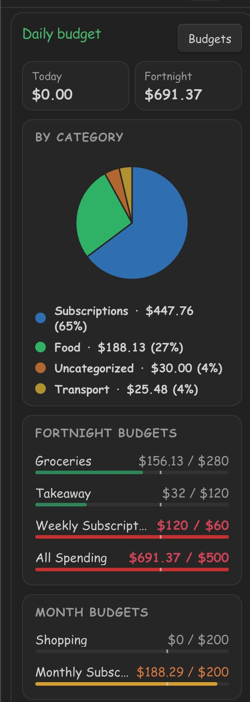

Tap a triage entry to edit its amount, category or merchant, delete it, or tick
"remember this merchant → category" to teach the [merchant map](#merchant-map).
Captures with a known merchant auto-categorise from it.

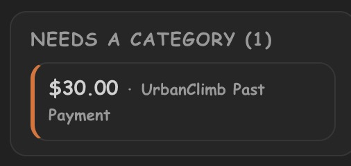

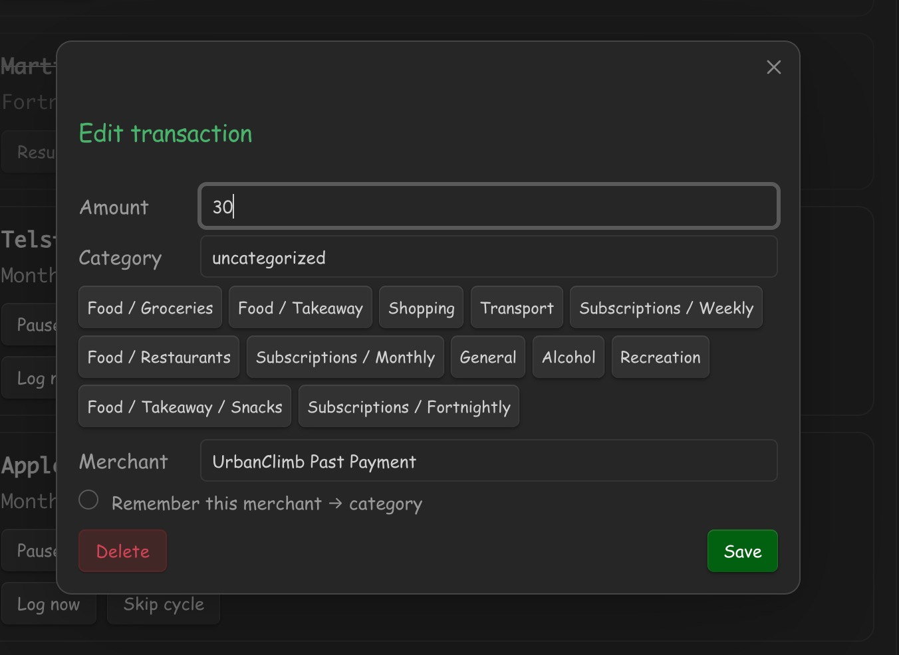

The **status bar** shows `💸 Today $X · Week $Y · 📥 N` (N = pending captures);
click it to quick-add.

## Merchant map

Learned merchant → category associations live in plugin settings (`data.json`),
not a vault note — there's nothing to hand-edit. The only way in is the
"Remember this merchant → category" checkbox (in the sidebar triage list or the
edit-transaction modal); the only way out is **Settings → Merchant map**, which
lists every learned merchant with a **Remove** button. Future captures from a
known merchant auto-categorise using this map (see
[Deferred categorisation](#deferred-categorisation)).

If you're upgrading from an older version, any existing `Merchant Map.md` note
is read once, folded into settings, and then deleted automatically — no action
needed.

## Reconciling against the bank

Command **Reconcile bank/Wise CSV against logged spending**: paste an ANZ or Wise
export. Rows are matched by date+amount (so merchant-name differences don't cause
duplicates); unmatched charges can be sent to the capture inbox to log and triage.

## Commands

Run any of these from the command palette (`Cmd/Ctrl+P`).

| Command | What it does |
| --- | --- |
| **Quick add transaction** | Opens the quick-add modal — one field, natural language, live preview. |
| **Drain capture inbox now** | Processes every file waiting in the capture inbox folder immediately, instead of waiting for the next automatic drain. |
| **Reconcile bank/Wise CSV against logged spending** | Opens the bank-reconcile modal — paste a CSV export, matches rows by date+amount, and can send unmatched charges to the capture inbox. |
| **Open daily budget** | Opens the Daily Budget sidebar (same as clicking the ribbon coin icon). |
| **Open finance budgets note** | Opens (creating if needed) the default `💸 Budgets.md` note. |
| **Add holiday exchange rate** | Opens a modal to add or update an `exchange_rates` entry on the active trip goal note. |
| **Create savings goal** | Opens a modal to create a new savings-goal note from the shared goal/trip frontmatter schema. |
| **Run first-time setup** | Opens the guided setup wizard — picks folders and currency, then creates any missing starter notes (never overwrites existing ones). |
| **Log due recurring payments** | Logs every recurring bill whose next-due date has arrived (loops to catch up several missed cycles), same as clicking **Log all due** in the block. |
| **Open recurring payments note** | Opens (creating if needed) the recurring payments management note. |
| **Insert recurring payments block** | Inserts a ` ```finance-recurring``` ` block at the cursor. |
| **Contribute to savings goal** | Opens a modal to log a contribution bullet to a chosen goal and date. |
| **Insert goals block** | Inserts a ` ```finance-goals``` ` block at the cursor. |
| **Archive completed savings goals** | Archives every savings goal that has reached its target amount — writes a frozen summary, marks it archived, and moves the note to the archive folder. |
| **Settle up split expenses** | Opens a modal showing outstanding split balances per person, with one-tap settle (logs the repayment as income). |
| **Insert split expenses block** | Inserts a ` ```finance-splits``` ` block at the cursor. |
| **Start trip** | Picks a trip goal note and switches quick-add/URL capture to default to that trip's tag (and currency, if set) until you end the trip. |
| **End trip** | Turns off trip mode, returning captures to normal home-currency logging. |
| **Archive finished holidays** | Archives every holiday budget past its `end_date` that isn't already archived — same frozen-summary treatment as savings goals. |
| **Snapshot balances** | Opens a modal to log one balance bullet per account into today's note (pre-filled with each account's last snapshotted value). |
| **Insert net worth block** | Inserts a ` ```networth-dashboard``` ` block at the cursor. |
| **Insert forecast block** | Inserts a ` ```finance-forecast``` ` block (default `months: 6`) at the cursor. |
| **Insert finance query block** | Inserts a ` ```finance-query``` ` block pre-filled with a monthly category-table template at the cursor. |
| **Insert yearly review** | Computes the current year's totals, best/worst month, top categories, and transfers summary, and inserts the finished markdown at the cursor (a frozen snapshot, not a live block). |
| **Insert quarterly review** | Same as above, scoped to the current quarter. |
| **Export finance transactions to CSV** | Exports every transaction ever logged (all time, all categories) to a CSV file. |

## Key settings

`dailyNotesFolder`, `spendingHeading` (`## Finance`), `defaultCurrency`,
`budgetsFolderPath` / `defaultBudgetNoteName`, `captureInboxFolder`,
`merchantMap` (learned merchant → category pairs), `autoDrainInbox`,
`budgetCheckPeriod`, `weekStartsOn`, `activeHolidayBudgetPath`,
`recurringTagPrefix` (`subscriptions`), `recurringNoteName`
(`🔁 Recurring Payments.md`), `excludedRecurringItems`, `autoLogRecurring`,
`quickAddUseNoteDate`, `tripModeActive` / `activeTripGoalPath`.

The daily-note folder and date format are auto-detected from the **Journals**
community plugin or the core **Daily notes** plugin when present; the manual
setting is the fallback.

## Development

```bash
npm test   # node --test, runs tests/*.test.js
```

Shared logic lives in `finance-core.js` (unit-tested) and is mirrored into a `core`
IIFE inside `main.js`, which Obsidian loads directly (no build step). A change to a
core function must be made in **both** places.
