# Finance Tracker

**Log spending as tags in your daily notes. Get budgets, trips, savings goals
and forecasts back.**

Your markdown notes stay the source of truth. There is no database and no
sync — uninstall the plugin tomorrow and you still have every transaction,
in plain text, in notes you can grep, link and edit by hand.

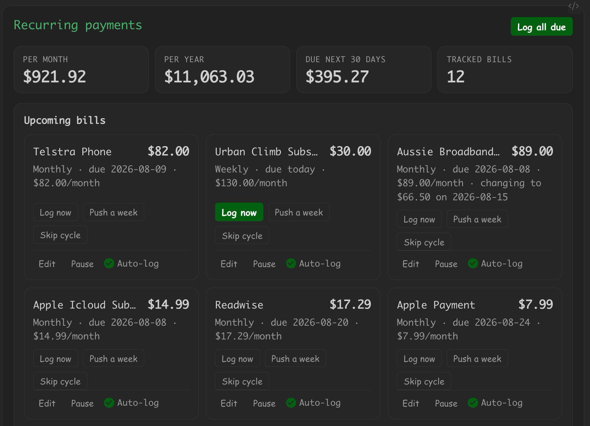

```md
## Finance
- [ ] #log/spending 16.20
	- $12.00 #log/spending/food/restaurants
		- Nobu
	- $4.20 #log/spending/food/snacks
```

That is the whole data format. Everything below is built from it.

- Runs on **desktop and mobile** (Obsidian 1.0+).
- **No network requests**, no telemetry, no bank connections.
- MIT licensed — see [LICENSE](LICENSE).
- Recent changes: [CHANGELOG.md](CHANGELOG.md).

Support the project: [Buy Me a Coffee](https://buymeacoffee.com/tonyhad)

## Contents

- [First-time setup](#first-time-setup-empty-vault) — the wizard, and what it creates
- [How logging works](#how-logging-works) — the tag format, and six ways to capture
- [Tag language](#tag-language) — spending, income, balances, trips, splits
- [Budgets](#budgets) — pace-aware limits in a markdown table
- [Dashboards](#dashboards) — the donut, trends and budget bars
- [Goals (savings + trips)](#goals-savings--trips) — sinking funds and trip mode
- [Recurring payments](#recurring-payments) — bills, cadences, and the lifecycle
- [Runway](#runway) — how much of your outgoings you have covered
- [Split expenses](#split-expenses) · [Forecast](#forecast) · [Net worth](#net-worth)
- [Query block](#query-block) · [Year & quarter reviews](#year--quarter-reviews)
- [Daily budget sidebar](#daily-budget-sidebar--status-bar) · [Merchant map](#merchant-map)
- [Commands](#commands) · [Settings](#key-settings) · [Limitations](#limitations)
- [Development](#development)

## First-time setup (empty vault)

On a fresh install the **setup wizard** opens automatically (or run the
**Set up finance notes** command / the button at the top of settings any time —
it never overwrites existing notes). It asks where your daily notes live, where
finance notes should be stored, your currency, and what to name the recurring
payments note (changeable later in settings) — then creates the starter notes
from templates embedded in the plugin:

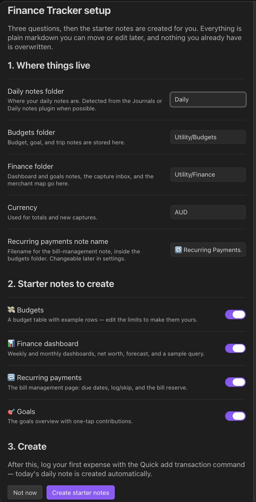

- `💸 Budgets.md` — the budget table
- `📊 Finance Dashboard.md` — weekly/monthly dashboards, net worth, forecast, a sample query
- `🔁 Recurring Payments.md` — the bill management page
- `🎯 Goals.md` — the goals overview with one-tap contributions

The manual path, if you prefer:

1. **Install & enable.** Copy this plugin to `.obsidian/plugins/finance-tracker/`,
   then Settings → Community plugins → enable **Finance Tracker**. (On mobile, turn
   on community plugins first.)
2. **Set two things** in the plugin's settings tab (Settings → Finance Tracker → Capture):
   - **Default currency** (e.g. `AUD`, `USD`).
   - **Daily notes folder** — point it at where you keep daily notes. Default is
     `Journal/Periodics/1. Daily`; the plugin routes captures to `<folder>/YYYY-MM-DD.md`
     (or `<folder>/YYYY/MM/YYYY-MM-DD.md` if you already use that structure).

   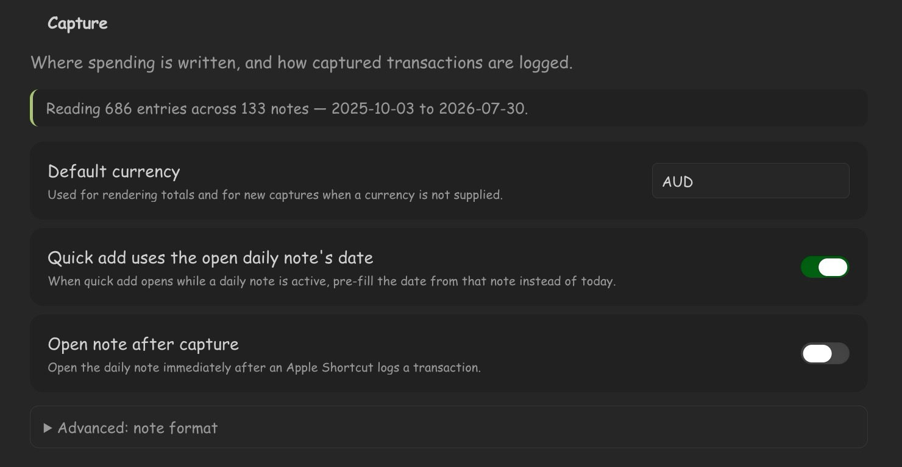
3. **Open the panel.** Click the **coin** ribbon icon (or run *Open daily budget*).
   This creates, on first run:
   - `Utility/Budgets/💸 Budgets.md` — a starter budget table you can edit.
   - `Utility/Finance/Inbox/` — the capture folder Shortcuts write to.
4. **Log your first transaction.** Run command **Quick add transaction**, type
   `12 coffee snacks`, press Enter. Today's note is created with a `## Finance`
   section and the entry; the panel and status bar update.
5. **Set your budgets.** Open `💸 Budgets.md` and edit the table rows to your own
   categories, limits and periods. Keep an `all` row for the overall bar + Left/Day.
6. **Add a dashboard (optional).** Put a ` ```finance-dashboard ` block (see
   [Dashboards](#dashboards)) in any note for charts and pace bars.
7. **Phone capture (optional but the point).** Pick the method that matches your sync
   (see [How logging works](#how-logging-works)): on **Obsidian Sync**, use a Shortcut
   that opens `obsidian://finance-capture?…` (no special storage needed); on an **iCloud
   Drive / Mac-local** vault you can instead drop capture files into your configured
   inbox folder. Step-by-step Shortcut recipes are in [How logging works](#how-logging-works) below.

Nothing else is required — daily notes, the budget note, and the inbox folder are
all created for you on demand.

## How logging works

Every transaction is a bullet under a `## Finance` heading in a daily note
(`…/YYYY/MM/YYYY-MM-DD.md`). The plugin maintains the checkbox total automatically:

```md
## Finance
- [ ] #log/spending 16.20
	- $12.00 #log/spending/food/restaurants
		- Nobu
	- $4.20 #log/spending/food/snacks
```

The same thing rendered in a real daily note:

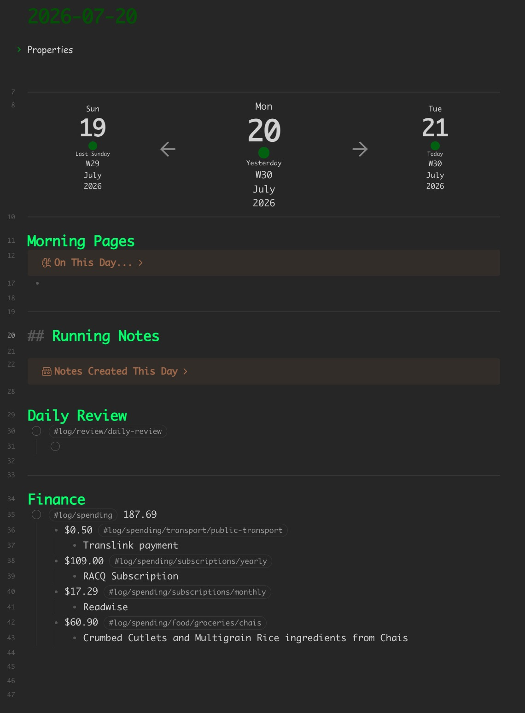

You rarely type this by hand. Six ways to log:

| Method | Opens Obsidian? | Use it for |
| --- | --- | --- |
| **`obsidian://finance-capture` URL** | yes, briefly | phone capture with **any** sync (incl. Obsidian Sync) |
| **Batched queue** (`?lines=`) | once per flush | high-volume phone capture — queue all day, flush once |
| **GitHub gist** | no | silent phone capture on **any** sync; the only method that works from an Apple Watch |
| **Capture inbox file** | no | **Files-writable** vaults only (iCloud Drive / Mac-local) |
| **Quick add modal** (command or status bar) | — | logging while you're in Obsidian |
| **Type the bullet yourself** | — | edge cases; the total self-heals on note open |

The first four are **capture methods**, and each has its own toggle in
**Settings → Capture methods**. They are designed to run at the same time — see
[Running several methods at once](#running-several-methods-at-once) for how the
plugin stops that turning into double-logged transactions. Quick add and
hand-typed bullets always work and have no toggle.

**Which phone method?** It depends on how the vault syncs, and on how much you spend:
- **Obsidian Sync** (the vault lives inside the Obsidian app) → **URL**, **batched queue**,
  or **gist**. Shortcuts can't write into Obsidian's sandbox, so the inbox-file method
  won't work on the phone.
- **iCloud Drive / Mac-local folder** → the **inbox-file** method also works (silent, no app
  launch), and the same folder lets Mac-side scripts and the in-app bank-CSV reconcile drop
  captures in.
- **A few transactions a day** → plain **URL** is simplest: nothing to set up but a Shortcut.
- **Every tap-to-pay auto-logged** → **batched queue** (one app switch a day) or **gist**
  (no app switch at all).

### URL Shortcut (works with any sync)
A Shortcut opens `obsidian://finance-capture?amount=12.5&merchant=Coles&category=food/groceries&source=manual`.
The plugin logs it to today's note. This briefly foregrounds Obsidian but needs no filesystem access.

The URL method also works as an **automation** — no Save File step needed on an Obsidian Sync vault.
This is the actual automation used against an ANZ Plus card (`source=anz`): a **Transaction**
trigger set to Run Immediately —

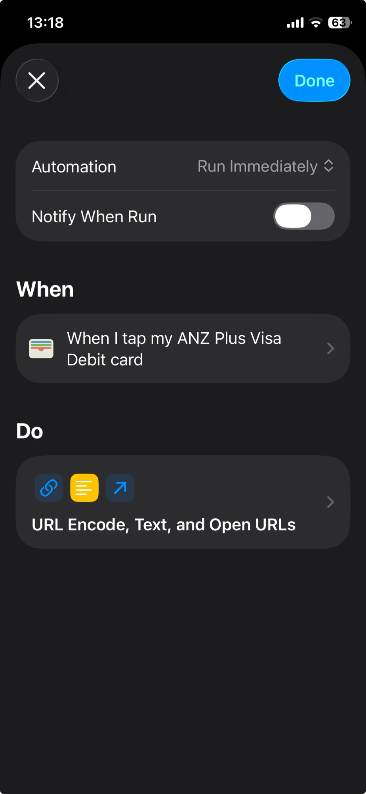

— followed by URL-encoding the merchant, building the `obsidian://finance-capture` URL, and opening it:

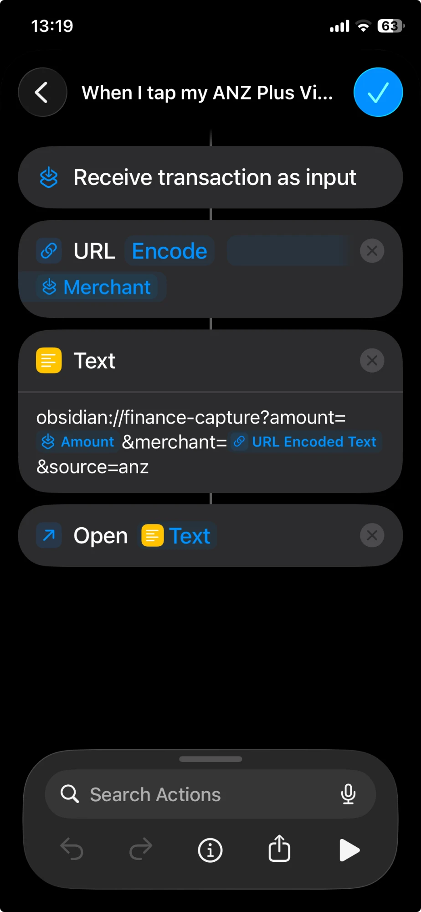

**Shortcut D — "Log + confirm in Obsidian"**: build an **Open URL** action —
`obsidian://finance-capture?vault=<vault>&amount=12.5&category=food/groceries&merchant=Coles&source=manual` —
and run it from the Home Screen, Lock Screen, or Action Button. This is the only phone method that
works on an Obsidian Sync vault; use it whenever you want the dashboard to update immediately.

### Batched queue (works with any sync)
The cost of the URL method is that every tap-to-pay yanks you into Obsidian. The batched
queue removes that: the automation **appends** each transaction to a list on the phone and
does nothing else, and a second Shortcut flushes the whole list in one app switch.

Capture a queue of lines into `lines=`, newline-separated, in the same one-line format the
capture inbox uses:

```
obsidian://finance-capture?lines=amount%3D12.50%20%7C%20merchant%3DColes%20%7C%20date%3D2026-07-30%0Aamount%3D4.20%20%7C%20merchant%3DBoost%20Juice%20%7C%20date%3D2026-07-30
```

**Shortcut E — "Queue spend" (automation)**: Shortcuts → **Automation** → **Transaction**
trigger, **Run Immediately**. Build one **Text** line —
`amount=[Transaction Amount] | merchant=[Transaction Merchant] | date=[Current Date · yyyy-MM-dd] | source=anz | id=[Current Date · yyyy-MM-dd'T'HHmmss]-[Random 1000–9999]`
— then **Add to Variable** → `FinanceQueue`, or append it to a [Data Jar](https://datajar.app)
value if you want the queue to survive between Shortcut runs (it does not otherwise).

**Shortcut F — "Flush spend queue"**: **Get Value from Data Jar** → **Combine Text** with
**New Lines** → **URL Encode** → **Text** = `obsidian://finance-capture?lines=[URL Encoded Text]`
→ **Open URLs** → **Delete Value from Data Jar**. Put it on an Automation for a time of day,
or on the Home Screen. Obsidian opens once, logs everything, and reports
`logged 7, skipped 1 duplicate`.

Each line is parsed independently, so one malformed line never costs you the rest of the
batch — bad lines land in `Inbox/_failed/` with the reason, exactly like a bad inbox file.
Including `id=` is worth the extra action: it means a re-run of the flush can never
double-log.

### GitHub gist (silent, works with any sync)
The only method that captures **without opening Obsidian** and still works on an Obsidian
Sync vault. The phone appends a line to a private gist; the plugin polls the gist with
Obsidian's own network layer (which works on iOS and Android), logs whatever is waiting,
then clears it. It is also the only method that works from an **Apple Watch**, where
`obsidian://` cannot open anything.

**Setup:**
1. Create a **secret gist** at [gist.github.com](https://gist.github.com) with one file named
   `finance-capture.txt` and any placeholder content (a `# queue` comment line is ideal — comment
   lines are ignored). Copy the gist **ID** from its URL: the long hex string after your username.
2. Create a **fine-grained personal access token** at
   *GitHub → Settings → Developer settings → Personal access tokens → Fine-grained tokens*.
   Give it **only** the **Gists: Read and write** account permission — nothing else, no repository
   access — and the shortest expiry you can live with.
3. In Obsidian: **Settings → Finance Tracker → Capture methods** → turn on **GitHub gist**, then
   fill in the gist ID, token, file name, and how often to poll. Hit **Sync now** to check it.

> **On the token.** It is stored in this vault's `data.json` in plain text, which is how every
> Obsidian plugin stores settings. A Gists-only token can read and write your gists and nothing
> else, but treat it like a password: don't commit `data.json`, and revoke the token on GitHub if
> the vault is ever shared or synced somewhere you don't control.

**Shortcut G — "Log spend (silent)"**: **Get Contents of URL** →
`https://api.github.com/gists/<gist-id>`, Method **GET**, Headers
`Authorization: Bearer <token>` → **Get Dictionary Value** `files` → `finance-capture.txt` →
`content`. Then **Text** = the existing content, a new line, and your capture line. Finally
**Get Contents of URL** → same URL, Method **PATCH**, same header, **Request Body → JSON**:
`{"files": {"finance-capture.txt": {"content": "[Text]"}}}`.

That is a read-modify-write, so keep the token in the Shortcut (never in the vault) and don't
run two flushes at the same second. The plugin's own drain is safe against this: it re-reads
the gist before clearing and preserves anything that arrived mid-sync, and if the file was
rewritten underneath it, it leaves the gist alone and says so rather than destroying captures.

The trade-off versus the URL methods: a gist write **needs a connection**. Shortcuts will fail
the action offline, where opening `obsidian://` would still have worked. If you're often
offline, add an **Otherwise** branch to the Shortcut that falls back to the URL method.

### Capture inbox (Files-writable vaults)
A Shortcut (or Mac script, or the bank-CSV reconcile) drops a one-line file into the
inbox folder (default `Utility/Finance/Inbox/`); the plugin drains it into the right daily
note on arrival and on launch. Capture line format — one line, `key=value` pairs separated by ` | `:

```
amount=12 | cat=food/restaurants | merchant=Nobu | date=2026-06-10 | cur=AUD | source=apple-pay
```

| Key | Meaning |
| --- | --- |
| `amount` (`amt`, `total`) | the amount to log — the only required key |
| `cat` (`category`) | category path, e.g. `food/groceries`. Omit to log as `uncategorized` and categorise later. |
| `merchant` (`payee`, `name`) | shown under the entry; also used to auto-guess the category from the merchant map |
| `date` | `YYYY-MM-DD`; defaults to today. Set it for retroactive logging — the plugin routes to that day's note. |
| `cur` (`currency`) | currency code; defaults to your vault default |
| `origamt` / `origcur` | foreign amount + currency (travel); the holiday dashboard converts it |
| `source` | free text, e.g. `apple-pay`, `wise`, `manual` |
| `id` (`wiseid`, `ref`) | external id for de-duplication (used by Wise sync / CSV reconcile) |

Bad files are moved to `Inbox/_failed/` with the error, never dropped.

**Shortcut A — "Log Spend" (manual, everyday)** — put it on the Home Screen, Lock Screen, Action
Button, and "Hey Siri, log spend":
1. **Ask for Input** → *Number* → "Amount?"
2. **Choose from Menu** → your categories + "Skip".
3. **Ask for Input** → *Text* → "Merchant?" (allow empty).
4. **Text** action: `amount=[Provided Input] | cat=[Menu Result] | merchant=[Text] | date=[Current Date · yyyy-MM-dd] | source=manual`
   (leave `cat=` empty if "Skip" was chosen).
5. **Save File** → iCloud Drive → the inbox folder → "Ask Where to Save" **off**, "Overwrite" **off**.
   Filename: `[Current Date · yyyy-MM-dd'T'HHmmss]-[Random 4 chars].txt`.

**Shortcut B — "Log Apple Pay" (automation, the important one)** — for a card you don't sync via
Wise: Shortcuts → **Automation** → **Transaction** trigger, filtered to that card, **Run Immediately**.
Build the same **Text** line from `Transaction Amount` / `Transaction Merchant`, leave `cat=` empty
(it auto-guesses from the merchant map or lands as `uncategorized`), add `source=anz`, then **Save
File** to the inbox as above. Every tap-to-pay now auto-logs with zero interaction. Don't also make
an Apple Pay automation for a card that's covered by Wise sync (below) — that would double-log it.

**Shortcut C — "Log Spend (pick date)"** — same as Shortcut A plus an **Ask for Input → Date** step
feeding `date=`, for backfilling a day you forgot.

<details>
<summary><b>Bank-specific automated capture</b> — Wise API sync and ANZ Plus CSV reconcile (click to expand)</summary>

These two are set up for the author's own accounts. The pattern generalises to
any bank that exports a CSV or exposes an API, but nothing here is required —
the URL shortcut and quick-add above cover everything.

#### Wise sync (covers all Wise spending, with real FX)
Wise personal API tokens support **balance statements**, so a scheduled Shortcut can pull every Wise
transaction — card, online, transfers — including the real exchange rate for foreign spends. Keep
the token in the Shortcut, never in the vault (generate it in Wise → Settings → API tokens; rotate
or revoke it there if needed).
1. **Get Contents of URL** → `GET https://api.wise.com/v1/profiles`, header `Authorization: Bearer <token>` → `profileId`.
2. **Get Contents of URL** → `GET /v4/profiles/{profileId}/balances?types=STANDARD` → `balanceId` per currency.
3. **Get Contents of URL** → `GET /v1/profiles/{profileId}/balance-statements/{balanceId}/statement.json?currency=AUD&intervalStart=<lastSync>&intervalEnd=<now>&type=COMPACT`.
4. For each activity newer than the last sync, **Save File** one inbox file: `amount=<spend> | merchant=<details> | date=<YYYY-MM-DD> | cur=AUD | source=wise | id=<referenceNumber>` (add `origamt=`/`origcur=` for foreign spends).
5. Store `lastSync` and schedule the Shortcut nightly. The `id=` field means re-runs never double-log.

#### ANZ Plus reconcile (catch what Apple Pay missed)
The Apple Pay automation only sees in-person taps — not online, direct debits, or BPAY. Monthly,
export the bank CSV and run **Reconcile a bank CSV**; unmatched charges
can be sent to the capture inbox. Matching is by date+amount, so already-logged taps aren't duplicated.

</details>

### Running several methods at once
Every capture method has its own toggle in **Settings → Capture methods**, and they are meant
to be combined — a bank automation feeding the queue, a gist for the Watch, quick add when
you're at the desk. The risk in combining them is the same purchase arriving twice.

**How duplicates are detected.** The plugin keeps a rolling record of what each method has
captured (the last 400, in `data.json`). A new capture is compared against it on **amount +
date + merchant**, and is treated as a duplicate only when the earlier copy came in by a
**different method or from a different `source=`**. That distinction is the whole point:

- Two $4.20 Boost Juices on the same day, both from the ANZ automation → **two real coffees**,
  both logged.
- One $12.50 Coles charge, once from the ANZ automation and once from the Wise sync →
  **one purchase captured twice**, logged once.

A missing merchant on one side still matches (bank feeds often carry a merchant the manual
capture lacks, and vice versa), and the **duplicate window** — 1 day by default — allows for a
feed that settles the day after the tap.

| Setting | Effect |
| --- | --- |
| **Skip the second one** (default) | The duplicate is not logged. A notice names the method that got there first. |
| **Log it, but tell me** | Both are logged, with a notice. Use this while you're still tuning which methods you want. |
| **Log everything** | Detection off. |

Quick add is exempt: it does its own "already logged today" check *before* you submit, so
pressing the button always logs. A deliberate human action is never silently dropped.

**Finding overlap.** Settings → Capture methods shows a live **Overlap check**, and the
**Check capture methods for overlap** command opens the full report: which pairs of methods
have been capturing the same transactions, how often, and the most recent example. If one pair
dominates, you're maintaining a method you could switch off. This is measured from what
actually happened rather than guessed from what each Shortcut is supposed to cover.

### Android
Nothing in the plugin is Apple-specific — the capture formats are a URL and an HTTP request,
and Obsidian's mobile app handles both identically on Android. Only the automation app changes:

| iOS | Android equivalent |
| --- | --- |
| Shortcuts (manual run) | [HTTP Shortcuts](https://http-shortcuts.rmy.ch/) (gist), or any launcher shortcut to an `obsidian://` URL |
| Shortcuts Automation (Transaction trigger) | [Tasker](https://tasker.joaoapps.com/) or [MacroDroid](https://www.macrodroid.com/), triggered on a **notification** from your banking app |
| Data Jar (queue storage) | Tasker variables or a local file |
| Action Button / Back Tap | home-screen widget, or Tasker's Quick Settings tile |

Two Android-specific notes:
- **There is no Apple Pay `Transaction` trigger.** The usual substitute is a **notification
  trigger** on your banking app, parsing the amount and merchant out of the notification text
  with a regex. That is inherently bank-specific and breaks when the bank rewords its
  notifications, so treat it as best-effort and keep the monthly CSV reconcile as the backstop.
- **The gist method is the better fit on Android**, because Tasker's HTTP Request action is
  first-class and you avoid the app-switch entirely.

> Untested. The author develops on iOS and has no Android device, so the Android column above is
> reasoning from each app's documented capabilities rather than something that has been run.
> The plugin side is identical either way — if you use it on Android, corrections are welcome.
>
> At current rates, [Buy Me a Coffee](https://buymeacoffee.com/tonyhad) needs to be clicked
> roughly 150 times before it becomes Buy Me A Second-Hand Pixel, at which point this section
> gets promoted from "reasoned about" to "actually tested". The finance tracker has, of course,
> already logged this as `#log/spending/hardware/research` and flagged it as over budget.

### Deferred categorisation
Capture is instant and dumb; categorisation is a quick daily review. Anything logged as
`uncategorized` (or auto-guessed wrong) can be fixed from the sidebar's **Needs a Category** triage
list or the daily note directly. Tick "remember this merchant → category" while fixing one and
future captures from that merchant categorise themselves (see [Merchant map](#merchant-map)).

### Quick add modal
Command **Quick add transaction** (bind a hotkey) or click the status bar. One field,
natural language, live preview:

```
12 nobu restaurants        $8 #transport Lime        4.50 coffee snacks @yesterday
```

First number = amount · a `cat/sub`, `#tag` or known category word = category ·
`@date` (ISO, `yesterday`, weekday, or anything the Natural Language Dates plugin parses) ·
the rest = merchant.

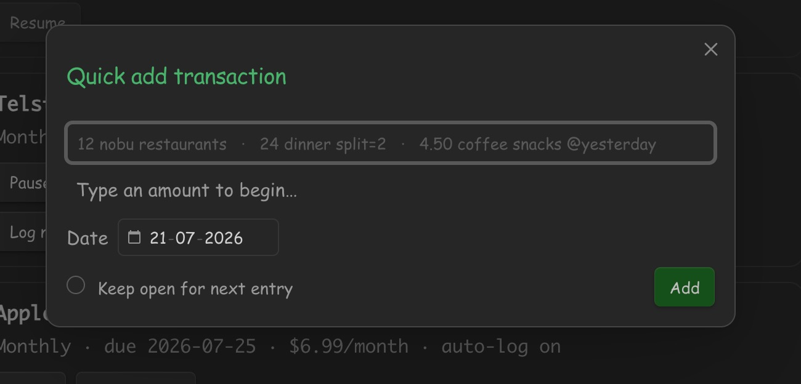

**Foreign currency, without storing a rate.** Put a currency code next to the
amount you were charged, then the amount it actually cost in your home currency.
Both are recorded; only the home amount counts toward budgets and totals.

```
58 USD : 83.64 obsidian sync #subscriptions/yearly/obsidian-sync
```

writes:

```md
- $58.00 USD : $83.64 AUD #log/spending/subscriptions/yearly/obsidian-sync
	- obsidian sync
```

The code can go on either side of the number and the separator is optional, so
`58usd 83.64`, `USD58 83.64` and `$58 USD = $83.64 AUD` all parse the same. The
preview shows the implied rate (`@ 1.4421`) so you can see you typed it right —
nothing stores it, and nothing converts anything for you. If you give only the
foreign amount, quick add says so rather than guessing a rate.

Only real currency codes count, so `58 oak table` is still $58 at "oak table".

**Duplicate guard.** If the same amount and merchant is already logged on that
date, the modal says so before you add a second one — a double-tapped Shortcut
is far more common than genuinely buying the same thing twice in a day.

**Autocomplete** — as you type, suggestions appear for **categories**,
**merchants**, and **people** (`owed=…`), all derived from what you have
actually logged plus your budget table — there is no category list to maintain.
Arrow keys cycle, **Tab** or **Enter** accepts the highlighted suggestion, **Esc**
dismisses. Once no suggestions are showing, **Enter** submits the entry — so
typing a full line is just Enter-Enter-Enter through each token, finishing on
a plain Enter with the popup closed. Accepting a known merchant also fills in
its remembered category.

**Date from the open note** — with the *Quick add uses the open daily note's
date* setting on (off by default), opening quick add while a daily note is
active pre-fills that note's date, so backfilling an old day is frictionless.

## Tag language

| Kind | Tag | Example bullet |
| --- | --- | --- |
| Spending | `#log/spending/<category>[/<sub>]` | `- $12 #log/spending/food/restaurants` |
| Income | `#log/income/<key>` | `- $2400 #log/income/salary` |
| Savings contribution | `#log/income/<goalKey>` | `- $500 #log/income/japanmidyear` |
| Savings withdrawal | `#log/spending/goal/<goalKey>/<category>` | `- $90 #log/spending/goal/rainy-day/medical` |
| Holiday spend | `#log/spending/<year>/<key>/<category>` | `- $40 #log/spending/26/japanmidyear/food` |
| Recurring bill | `#log/spending/subscriptions/<cadence>/<name>` | `- $12.99 #log/spending/subscriptions/monthly/spotify` |
| Owed share (child line) | `#log/owed/<person>` | `	- owes: Sam $8.00 #log/owed/sam` |
| Balance snapshot | `#log/balance/<account>` | `- $5,230.00 #log/balance/anz-plus` |

The amount is a `$`-prefixed number on the bullet; a child line is the merchant, a
second child is a note. Categories are slash paths (`food/restaurants`).

Because every entry is just a tag, Obsidian's own tag pane doubles as a category
browser — nested paths become a real tree, with a live count per level:

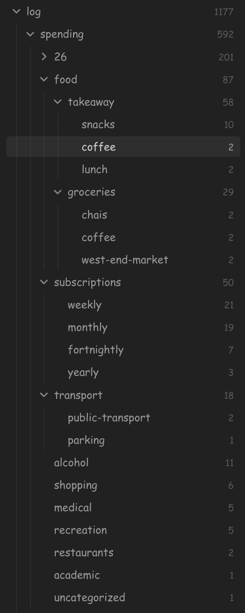

## Budgets

Budgets are a markdown table in `Utility/Budgets/💸 Budgets.md`:

```md
| Name         | Category   | Limit | Period | Currency |
| ------------ | ---------- | ----: | ------ | -------- |
| Groceries    | groceries  |   140 | week   | AUD      |
| Shopping     | shopping   |   200 | month  | AUD      |
| All Spending | all        |   250 | week   | AUD      |
```

A real budgets note, with the free-form Notes section people tend to add below the table:

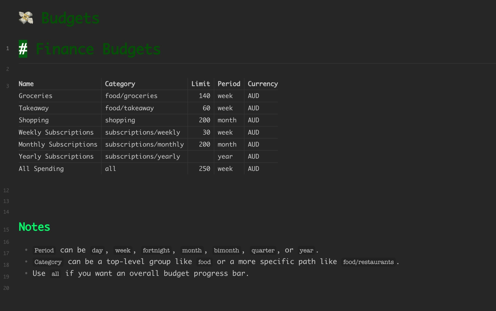

- **Category** is a top-level group (`food`) or a path (`food/restaurants`); `all`
  budgets everything.
- **Period**: `day`, `week`, `fortnight`, `month`, `bimonth`, `quarter`, `year`.
  Limits scale by calendar days when shown over a different range (a weekly $140
  shows as ~$600 on a monthly dashboard).
- Bars are **pace-aware**: a marker shows where you should be today, the colour
  reflects whether you're ahead of pace (not just over the cap), and each bar
  shows the projected end-of-period spend and a safe `$/day` for the days left.
- An `all` budget also drives the **Left / Day** card and the daily-spend trend line.
- **Trip-tagged spending never counts toward home budgets.** An entry like
  `- $40 #log/spending/26/japan/shopping` is a withdrawal from that trip's
  savings goal: it shows on the holiday dashboard and reduces the goal, but is
  excluded from regular budgets, dashboards, the sidebar totals, and the
  forecast. Use `type: all` in a `finance-query` block for a report that
  includes trip entries.

## Dashboards

Add a fenced code block to any note; each reads transactions from your daily notes.

````md
```finance-dashboard
period: week        # day | week | fortnight | month | bimonth | quarter | year
groupBy: primary    # primary | full
currency: AUD       # optional override
start: 2026-06-01   # optional explicit range (needs end)
end: 2026-06-30
title: June Spending
```
````

Shows summary cards (total, avg/day, vs previous period, top category), a
**three-ring category donut** — inner ring is the major categories, middle
ring is each subcategory as its own colour section (a shade of its parent's
hue), and the outer ring splits each subcategory further into its own leaf
items — with a nested legend — a daily-spend sparkline with your budget line,
pace-aware budget bars, and savings activity. Export CSV from the header.
(The sidebar's mini pie stays at major categories; the donut falls back to a
flat pie when nothing has subcategories.) A category that's only two levels
deep (e.g. `shopping/amazon`, nothing beneath it) has no leaf level to split
into, so its outer-ring band just continues as one uninterrupted block in the
same colour rather than an arbitrary extra seam. Shades within a ring are
ranked by spend — the biggest item gets the lightest shade of that hue, the
smallest the darkest — and hovering any slice (at any of the three levels)
shows its name, amount, and share of the total.

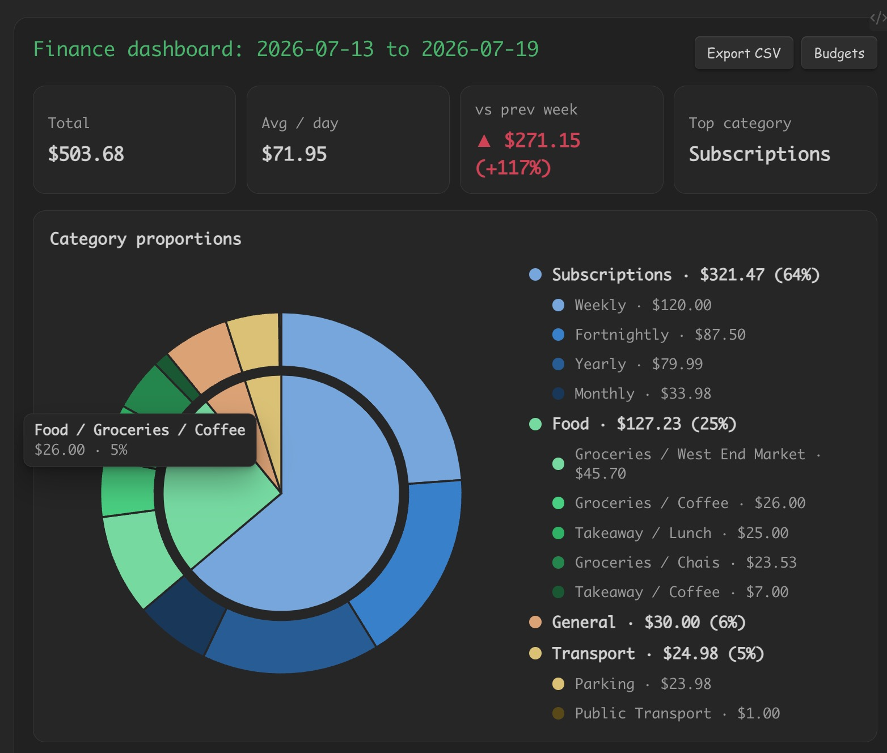

`holiday-dashboard` — planned vs actual trip spend, per-day budget remaining, and a
trip calendar. Reads a goal note that has a `trip_tag` (see [Goals](#goals-savings--trips)),
plus its Planned/Allocated tables. **Once the trip has ended** (past `end_date`,
or the note is archived) the same block automatically becomes a **trip
reflection**: total and after-trip spend, how it landed against the budget,
average per day, biggest and quietest days, a per-category table (total, avg/day,
share, and the biggest single expense with its merchant), a spend-by-day chart,
and planned-vs-paid. Force either mode with `view: live` or `view: reflection`.

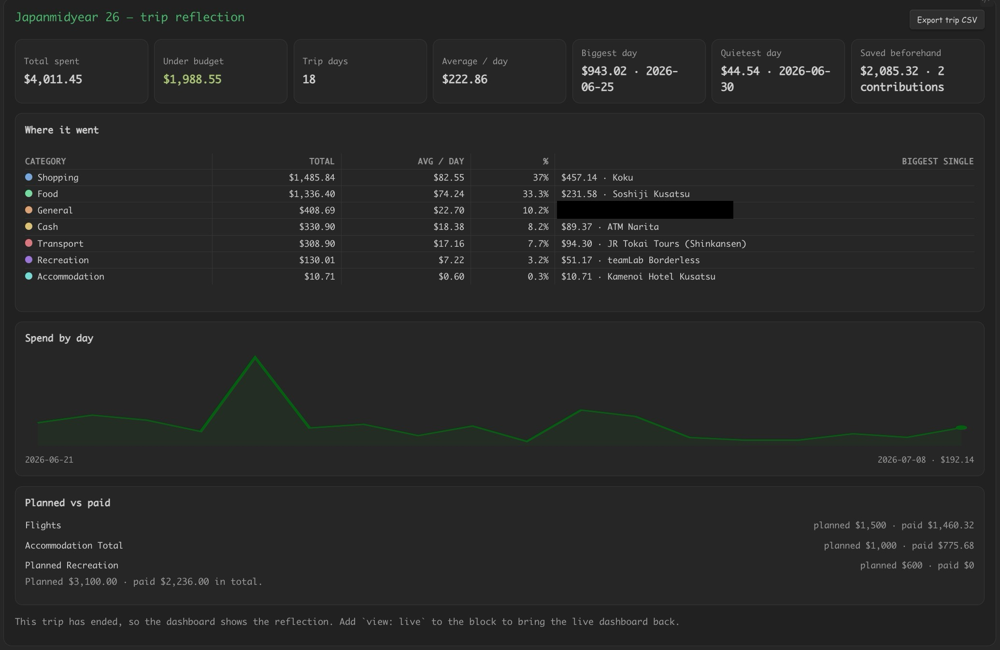

`savings-dashboard` — per-goal progress, contributions, sinking-fund set-aside and
pace. Reads a goal note (frontmatter `goal_key`, `target_amount`, `due_date`, …).

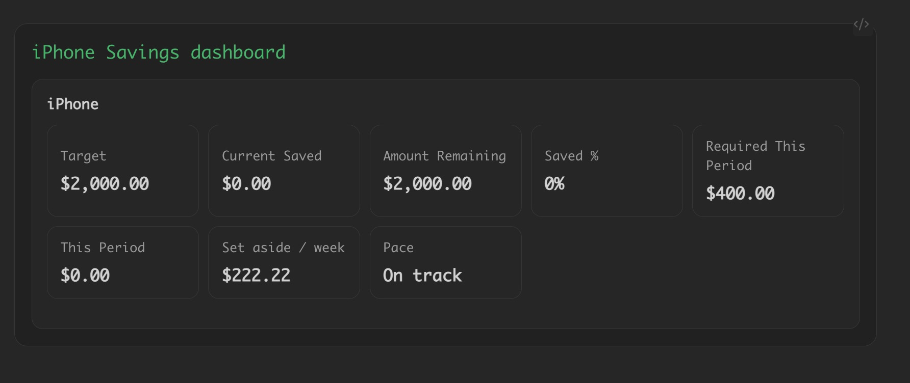

Every chart shares one **hue-family colour system**: each major category gets a
base hue, its subcategories render as lighter/darker shades of that hue, and
pies and legends rank by major-group total with subgroups nested beneath.

These defaults — grouping, week start, and the budget check period — live in
Settings → Dashboard:

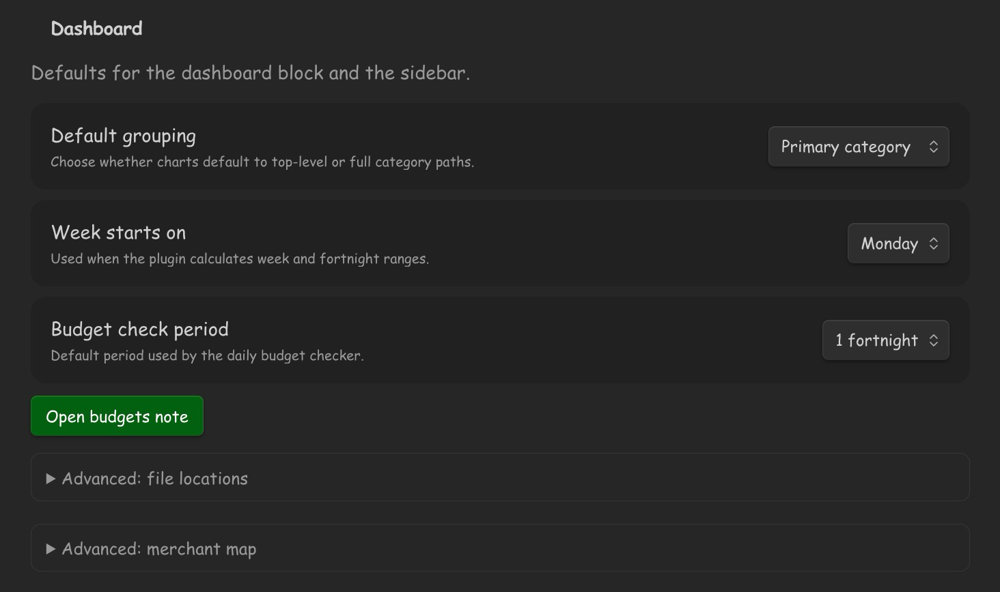

## Goals (savings + trips)

Savings goals and holiday budgets share **one frontmatter schema**. Any goal with
`target_amount` and `due_date` automatically shows sinking-fund math — the
set-aside needed per week and whether you're ahead of or behind the linear pace.
A holiday is simply a goal that also has a `trip_tag`, dates, and a currency.
Command: **Create savings goal** (or the buttons in settings).

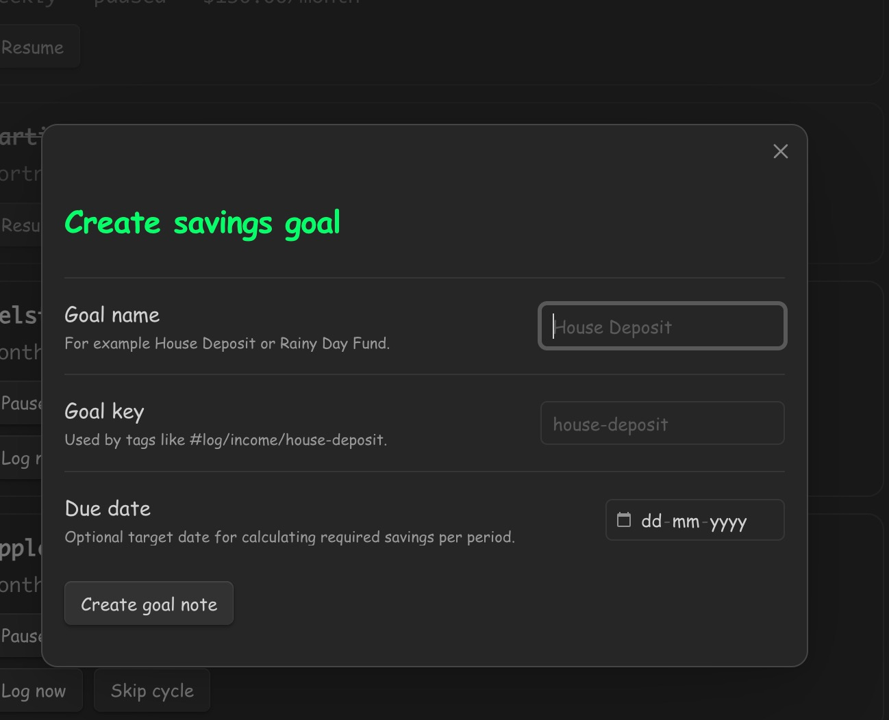

```md
---
goal_name: Roadbike
goal_key: roadbike
target_amount: 3000
starting_balance: 0
due_date: 2026-12-10
active: true
currency: AUD
---

```savings-dashboard
```
```

A trip goal adds the trip keys (and optionally `trip_currency` for trip-mode capture):

```md
---
goal_name: Japan Mid-Year
goal_key: japanmidyear
target_amount: 6000
due_date: 2026-06-18
trip_tag: 26/japanmidyear
trip_currency: JPY
start_date: 2026-06-21
end_date: 2026-07-08
total_budget: 6000
currency: AUD
exchange_rates: JPY=0.00877
---
```

Contributions are `- $500 #log/income/roadbike` bullets; withdrawals are
`- $90 #log/spending/goal/roadbike/<category>`. The legacy `goal_key` /
`holiday_tag` frontmatter still parses, so un-migrated notes keep rendering.

### Contributing to goals

Command: **Contribute to a goal** (also the Contribute buttons in the
goals block below)

Logs a contribution bullet — `- $150.00 #log/income/roadbike` — into the chosen
day's note. Contributions are **virtual envelopes**: nothing requires a real
bank transfer, so this works whether each goal has its own account or every
goal lives inside one lump-sum savings account.

### Goals overview block

Command: **Insert a finance block** → Goals

````md
```finance-goals
account: short-term-savings   # optional — reconcile against a real account
```
````

One card per goal: saved vs target, the weekly set-aside still needed,
ahead/behind pace, and a **Contribute** button. With `account:` it compares the
sum of your goal envelopes against that account's latest `#log/balance/…`
snapshot and shows the **unallocated** remainder — the piece of the lump sum
not yet promised to any goal (or a warning when you've over-allocated).

### Multiple trips & archiving

Commands: **Archive finished trips** · **Archive completed goals**
(or the per-note toggles and Archive buttons in Settings → Holiday budgets)

You can save for **several holidays at once** — every goal note with
`active: true` shows in the sidebar and counts toward forecast set-asides, and
capture routes to whichever trip's dates match.

When a trip is over — or a savings goal has hit its target — archive it.
Archiving writes a frozen **Archive summary** into the note: the savings steps
(every contribution, dated), withdrawals, and for trips how the money was
spent during the trip and after its end date. The note is then marked
`archived: <date>` and moved to the archive folder. The note keeps its full
history and its dashboards still render when you open it, but it leaves the
active set: no more capture routing, sidebar cards, or forecast set-asides.

```md
## Archive summary (2026-07-25)

- Target: $3,500.00
- Saved: $3,500.00 (100% of target) — $500.00 starting balance + 2 contributions

### Savings steps

| Date       |    Amount | Note             |
| ---------- | --------: | ---------------- |
| 2026-05-01 | $1,500.00 | Savings transfer |
| 2026-06-01 | $1,500.00 | Savings transfer |

### How it was spent

- Trip budget: $3,500.00
- Spent during the trip: $2,914.00 across 41 entries
- Spent after 2026-07-24: $40.00 across 1 entry
```

## Recurring payments

Command: **Log due recurring payments** · **Insert a finance block** → Recurring payments

Tag a bill once with a cadence subtag under the recurring prefix (default
`subscriptions`; configurable in settings) and it becomes a tracked recurring
payment. The amount is inferred from the last logged entry, and next-due from
the last logged date plus the cadence (`weekly`, `fortnightly`, `monthly`,
`quarterly`, `yearly`):

```md
## Finance
- [ ] #log/spending 31.49
	- $12.99 #log/spending/subscriptions/monthly/spotify
		- Spotify
	- $18.50 #log/spending/subscriptions/weekly/gym
		- Anytime Fitness
```

Then drop this block into any note:

````md
```finance-recurring
```
````

It shows upcoming bills, overdue items with a one-tap **Log now**, the total
due in the next 30 days, and the cost per month and per year. Each row's
actions are weighted: **Log now** is filled when the bill is actually due, and
everything else (Push a week, Skip cycle, Edit, Pause) stays
as a quiet outline, so the eye lands on the action worth taking without
reading every label. An optional
setting (**Auto-log recurring payments**) logs each item automatically on its
due day. Anything due or overdue also stays pinned in the **Daily Budget**
sidebar until you log it — see [below](#daily-budget-sidebar--status-bar).

**Log now logs today, not the due date** — click it (from the sidebar, the
block, or manage mode) and the bullet is dated on the real day you actually
paid it, even if that's a few days after it was due. The cadence schedule
itself doesn't drift because of this: it keeps advancing from the due date
that was just fulfilled, not from today, so a late payment never pushes every
future due date out by the same number of days. **Skip cycle** works the same
way (logs a $0 entry, the schedule moves on, the price is remembered), and
**Push a week** moves only the next due date — for the month the rent lands
late, without touching the cadence.
**Sort order** — the Settings tab has a **Sort bills by**
dropdown (due date, cost per month, or name) that reorders the
Upcoming bills list, the sidebar's due-bills card, and the settings list
below all at once.

**Managing bills** — command **Open recurring payments note** creates a
management page (a normal note with a `manage: true` block). In manage mode
every item gets **Log now**, **Push a week**, **Skip cycle**, **Pause**,
**Auto-log**, and **Edit**. Only the bill that is actually due gets a filled
**Log now** — everything else stays a quiet outline, so six controls on a card
still read as one obvious action:

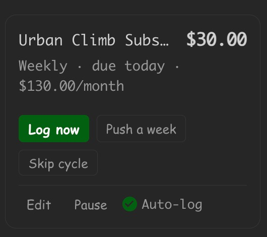

Scheduling a price change, or giving a bill an end date or a payment count, is
behind **Edit**:

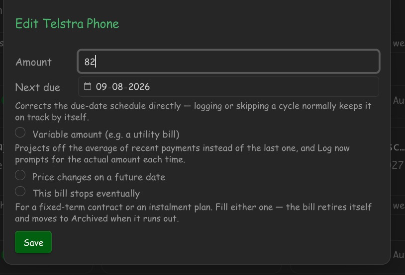

**Price changes show you which cycles they hit.** Under the fields, **Upcoming
payments** lays out the next eight cycles with the amount each one will actually
be charged, highlighting the first cycle at the new price, and sums it up in a
line like *"3 more payments at $89.00 ($267.00), then $66.50 from 10 Nov 2026"*.
It updates as you type, so moving the change date a few days either side of a
due date shows the consequence before you save. A change dated before the next
due date reprices every remaining payment, and the per-month/per-year totals,
the runway target and *due next 30 days* all follow it. **Log now** and auto-log
deliberately don't: a payment made today is charged today's price.

**Payment calendar** — below the bill list, a month grid shows when the bills
actually land, so a week with three of them due on the same day is obvious at a
glance. Each day carries a dot per bill (red overdue, accent normal, yellow for
a repriced payment) and its daily total; click one for the breakdown. Weeks with
nothing due are skipped. The **1 month / 3 months / 12 months** buttons switch
the horizon for the session, Settings → Dashboard → **Payment calendar range**
sets the default, and `months: 12` in the block config pins it per note.

**Pausing, retiring and removing** — **Pause** moves a bill into a collapsed
**Archived** section at the bottom of the block. A bill that reached its End Date
or ran out of Payments Left lands there too, labelled *ended 2027-03-01* or *all
payments made* rather than *paused*. From there, **Resume** (or **Restart**, which
also clears the terms) brings it back, and **Remove completely** drops it for
good — even if you later log another entry with the same tag, it will not
resurface. Either way its history stays intact in your notes.

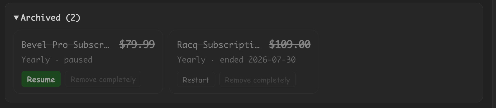

**In settings** — Settings → Recurring payments lists every current bill as a
scrollable table with the header pinned, so **Active** and **Auto-log** can be
toggled for all of them in one place. Paused, retired and removed bills are not
listed here; that view is only for bills still running.

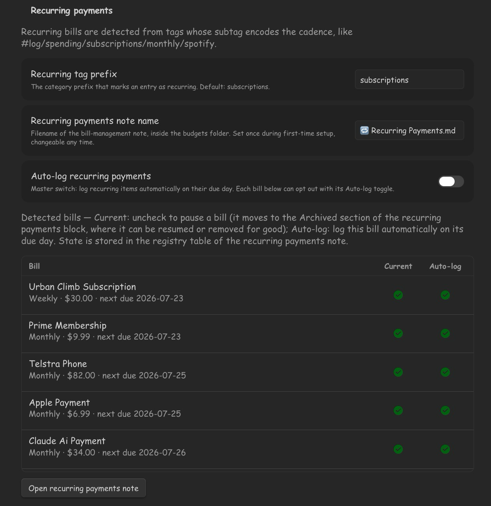

## Runway

Command: **Insert a finance block** → Runway · Settings → **Runway**

*How much do I need to keep available to be safe for the next month?*

Runway answers that and nothing else. It is a **read-only figure** — there is no
envelope to fund, no balance, no contributions and no bookkeeping. Pick a period
and what counts, and it reads the bills you have already logged:

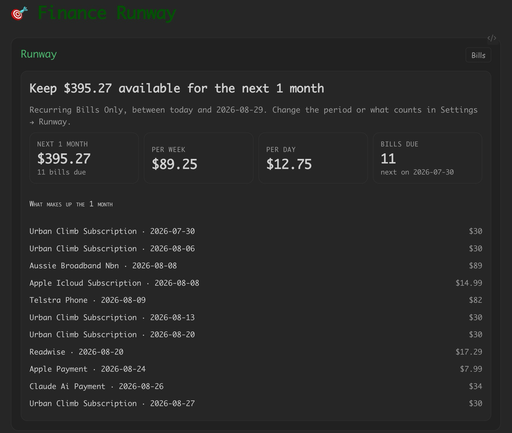

> **Keep $395.27 available for the next 1 month**
> Recurring bills only, between today and 2026-08-29 · 11 bills due

Two settings, both in Settings → **Runway**:

| Setting | Options |
| --- | --- |
| **Runway period** | 1 week · 2 weeks · 1 month · 2 months · 3 months · 6 months |
| **What counts** | Bills + usual spending (default), or recurring bills only |

The settings page shows the resulting figure live, so choosing a period is not
abstract.

**The figure walks your actual schedule.** It is the sum of every bill occurrence
that lands inside the window, not a monthly average scaled up. A $900 annual
insurance renewal is worth nothing while it is eleven months away and worth all
$900 the moment it enters the window — because that is the month you need the
money. "Bills + usual spending" adds your average discretionary spend over the
last 90 days, scaled to the window.

Every bill making up the total is listed with its date, soonest first, so the
number is never a black box. There is also a **per week** and **per day**
breakdown. The same card also appears at the bottom of the recurring payments
block, since that is where your bills live.

If you tracked a **bill reserve** in 0.6, those `#log/income/billreserve` bullets
are left alone. They no longer feed a balance, but they still count as transfers
rather than income, so your reviews and forecasts are unaffected.

## Split expenses

Command: **Settle up split expenses** · **Insert a finance block** → Split expenses

Quick-add and `obsidian://finance-capture` accept `split=N` (even split — your
share is amount ÷ N) and `owed=Name:$X` tokens:

```
24 nobu restaurants split=2          → you owe $12, someone owes you $12
30 dinner restaurants owed=Sam:$10   → Sam owes $10 of the $30
```

The full amount stays on the bullet, with a hand-editable child line per person.
Only **your share** counts toward budgets:

```md
	- $24.00 #log/spending/food/restaurants
		- Nobu
		- owes: Sam $12.00 #log/owed/sam
```

The ` ```finance-splits``` ` block and a sidebar card sum outstanding balances
per person. **Settle up** logs the repayment as income
(`- $12.00 #log/income/settleup/sam`) and appends `· settled <date>` to the owed
lines.

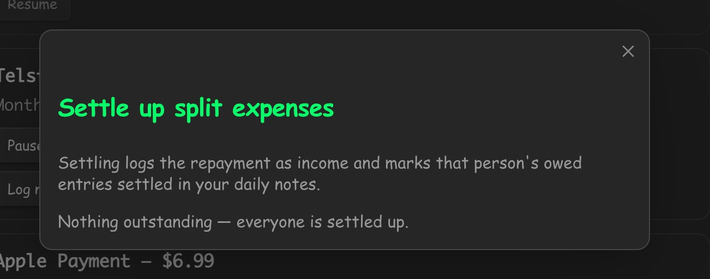

## Trip mode

Commands: **Start trip** · **End trip**

Start trip picks a trip goal note and, until you end the trip, quick-add and URL
captures default to the trip tag — and to the trip currency when `trip_currency`
is set, converting to your home currency through the note's stored exchange
rates. The sidebar shows spent-today, trip budget remaining, and a safe $/day
for the days left.

## Forecast

Command: **Insert a finance block** → Forecast

````md
```finance-forecast
months: 6
```
````

Projects recurring income, minus recurring bills, minus your trailing-90-day
average discretionary spend, forward N months — including committed goal
set-asides — as a line chart with a `~$X by <date>` headline. Override any
input with `income:`, `bills:`, `discretionary:`, `setaside:`, or `start:`.

## Net worth

Command: **Snapshot balances** · **Insert a finance block** → Net worth

Snapshot balances logs one bullet per account into today's daily note (accounts
you've snapshotted before are pre-filled):

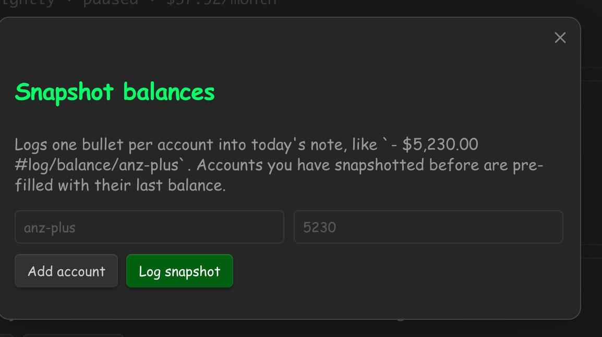

```md
- $5,230.00 #log/balance/anz-plus
- $812.40 #log/balance/wise
```

The dashboard renders the balance trend from those bullets — no extra files:

````md
```networth-dashboard
```
````

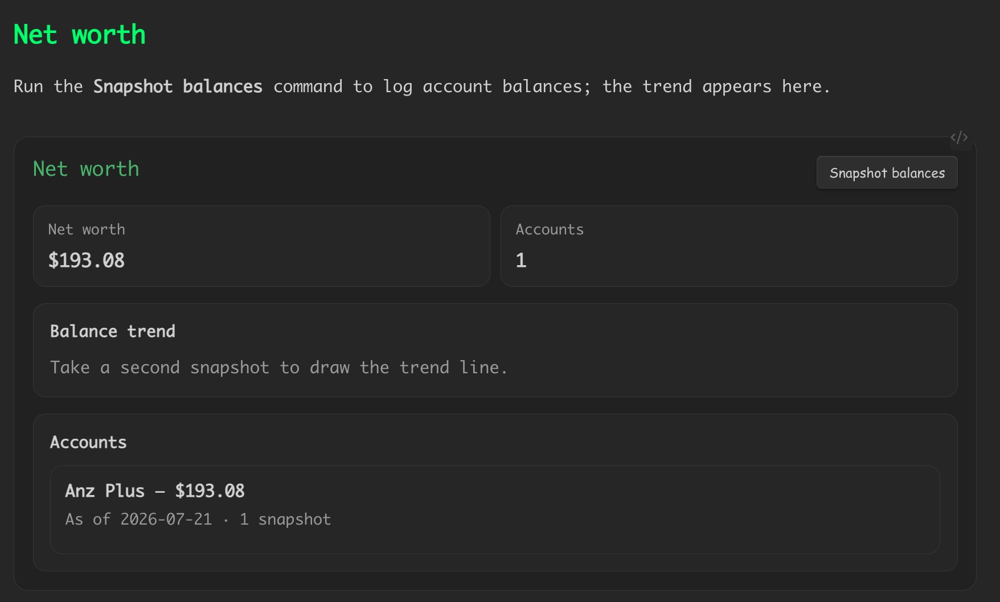

## Query block

Command: **Insert a finance block** → Query

A read-only report over your entries — filter by category, tag, merchant, or
date range; group by category, merchant, or month; sum or count:

````md
```finance-query
period: month        # or start: / end: dates
category: food       # optional prefix filter
merchant: nobu       # optional substring filter
type: spending       # spending | income | all
group: category      # category | category-full | merchant | month | none
op: sum              # sum | count
view: table          # table | categories | bars | income-expense | cumulative
```
````

Views: `table` (grouped sums), `categories` (ranked category table with
percentages), `bars` (ranked bars), `income-expense` (monthly income-vs-expense
bars), `cumulative` (cumulative balance line).

## Year & quarter reviews

Command: **Insert a finance block** → Year in review / Quarter in review

Unlike the other entries in that list, these two don't insert a live code
block — they compute the numbers once, right now, and insert the finished
markdown at your cursor. Run one inside a "Yearly Review" or "Quarterly
Review" note (or any note) to drop in a frozen snapshot for the current
year/quarter: total spent and income, the best and worst month by spend, the
top spending categories with their share of the total, and a transfers
summary (savings contributions, savings withdrawals, settled split repayments
received, and runway contributions). Re-running the command later
produces a fresh snapshot reflecting whatever you've logged since.

```md
## 2026 Year in Review

- Period: 2026-01-01 to 2026-12-31
- Total spent: $18,240.55
- Total income: $64,000.00
- Best month (lowest spend): 2026-02 — $980.10
- Worst month (highest spend): 2026-07 — $4,011.45

### Top spending categories

| Category | Total | % of spend |
| --- | ---: | ---: |
| Food | $5,120.30 | 28% |
| Subscriptions | $2,890.00 | 16% |

### Transfers

- Savings contributions: $3,000.00 (4)
- Savings withdrawals: $250.00 (1)
- Settled repayments received: $120.00 (2)
- Runway contributions: $400.00 (4)
```

## Daily budget sidebar & status bar

The **Daily Budget** sidebar (ribbon coin icon) shows today + period spend, a
Left/Day card, a mini pie, compact pace-aware budget rows (tap a row for the
detail), savings goals, split balances, a **Recurring bills due** card, and a
**Needs a Category** triage list.

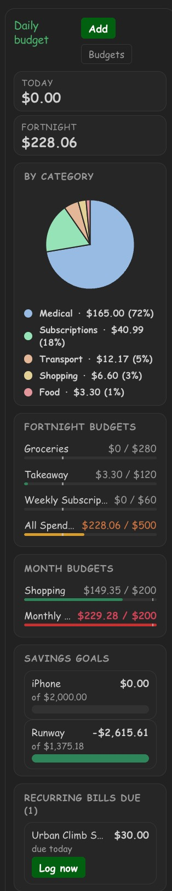

**Recurring bills due** lists every overdue or due-today bill with a one-tap
**Log now**, and stays put — it doesn't disappear until each bill is actually
logged, so it can't get lost among the rest of the sidebar.

Tap a triage entry to edit its amount, category or merchant, delete it, or tick
"remember this merchant → category" to teach the [merchant map](#merchant-map).
Captures with a known merchant auto-categorise from it.

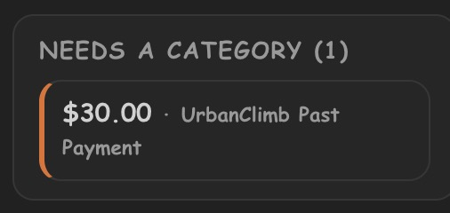

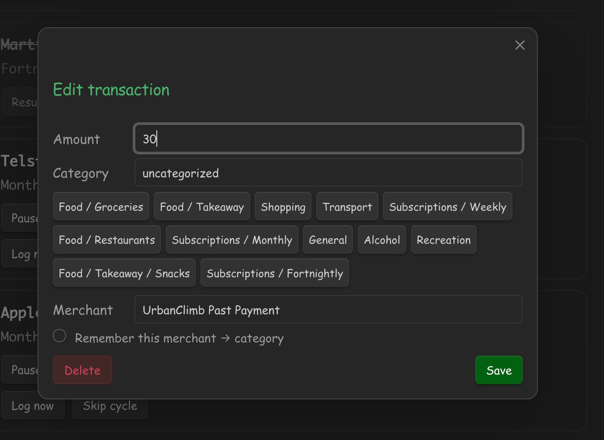

The **status bar** shows `💸 Today $X · Week $Y · 📥 N` (N = pending captures);
click it to quick-add.

## Merchant map

Learned merchant → category associations live in plugin settings (`data.json`),
not a vault note — there's nothing to hand-edit. The only way in is the
"Remember this merchant → category" checkbox (in the sidebar triage list or the
edit-transaction modal); the only way out is **Settings → Merchant map**, which
lists every learned merchant with a **Remove** button. Future captures from a
known merchant auto-categorise using this map (see
[Deferred categorisation](#deferred-categorisation)).

If you're upgrading from an older version, any existing `Merchant Map.md` note
is read once, folded into settings, and then deleted automatically — no action
needed.

## Reconciling against the bank

Command **Reconcile a bank CSV**: paste an ANZ or Wise
export. Rows are matched by date+amount (so merchant-name differences don't cause
duplicates); unmatched charges can be sent to the capture inbox to log and triage.

## Commands

Run any of these from the command palette (`Cmd/Ctrl+P`). Obsidian prefixes each
with **Finance Tracker:**.

| Command | What it does |
| --- | --- |
| **Quick add transaction** | Opens the quick-add modal — one field, natural language, live preview. |
| **Open daily budget** | Opens the Daily budget sidebar (same as clicking the ribbon coin icon). |
| **Log due recurring payments** | Logs every recurring bill whose next-due date has arrived (loops to catch up several missed cycles), same as **Log all due** in the block. |
| **Contribute to a goal** | Log a contribution to a chosen goal and date. |
| **Settle up split expenses** | Outstanding split balances per person, with one-tap settle (logs the repayment as income). |
| **Snapshot balances** | Log one balance bullet per account into today's note, pre-filled with each account's last snapshotted value. |
| **Insert a finance block** | Pick a block from a list — dashboard, recurring payments, goals, splits, forecast, net worth, query, or a frozen year/quarter review — and insert it at the cursor. Replaces the eight separate `Insert … block` commands. |
| **Start trip** / **End trip** | Switches quick-add and URL capture to a trip's tag and currency, and back. |
| **Add trip exchange rate** | Add or update an `exchange_rates` entry on the active trip note. |
| **Create savings goal** | Create a savings-goal note from the shared goal/trip frontmatter schema. |
| **Archive finished trips** | Archives every trip past its `end_date` — writes a frozen summary and moves the note to the archive folder. |
| **Archive completed goals** | The same, for every savings goal that has reached its target. |
| **Process capture inbox** | Processes every file waiting in the capture inbox folder immediately, instead of waiting for the next automatic drain. |
| **Sync capture gist now** | Polls the capture gist immediately instead of waiting for the next scheduled check. |
| **Check capture methods for overlap** | Reports which pairs of capture methods have been logging the same transactions, so you can switch off one you don't need. |
| **Reconcile a bank CSV** | Paste a bank or Wise CSV export; matches rows by date+amount and can send unmatched charges to the capture inbox. |
| **Repair daily note totals** | Recomputes the `#log/spending` running total on every daily note in one pass. Individual notes heal when opened; this fixes a whole backlog at once. |
| **Export transactions to CSV** | Exports every transaction ever logged (all time, all categories) to a CSV file. |
| **Open budgets note** | Opens (creating if needed) the default `💸 Budgets.md` note. |
| **Open recurring payments note** | Opens (creating if needed) the recurring payments management note. |
| **Set up finance notes** | Opens the guided setup wizard — picks folders and currency, then creates any missing starter notes (never overwrites existing ones). |

## Key settings

Settings are grouped into **Capture**, **Capture methods**, **Dashboard**,
**Trips**, **Savings goals**, **Recurring payments** and **Setup**. Anything that first-time setup
sets for you — folder paths, the finance heading, the spending root tag, note
filenames, the merchant map — lives behind an **Advanced** disclosure in its
section rather than in the default view.

The Capture section opens with a live status line (`Reading 412 entries across
89 notes — 2024-01-03 to 2026-07-29`). If the daily-notes folder or finance
heading is wrong, that line says so instead of leaving you with a silently empty
dashboard.

`dailyNotesFolder`, `spendingHeading` (`## Finance`), `defaultCurrency`,
`budgetsFolderPath` / `defaultBudgetNoteName`, `captureInboxFolder`,
`captureMethods` (per-method on/off), `crossMethodDuplicates`
(`skip` / `warn` / `off`), `duplicateWindowDays`, `captureLedger` (the rolling
record of what each method captured, used for duplicate detection and the
overlap report), `gistCaptureId` / `gistCaptureToken` / `gistCaptureFilename` /
`gistCapturePollMinutes`,
`merchantMap` (learned merchant → category pairs), `autoDrainInbox`,
`budgetCheckPeriod`, `weekStartsOn`, `activeHolidayBudgetPath`,
`recurringTagPrefix` (`subscriptions`), `recurringNoteName`
(`🔁 Recurring Payments.md`), `excludedRecurringItems`, `autoLogRecurring`,
`quickAddUseNoteDate`, `tripModeActive` / `activeTripGoalPath`,
`schemaVersion` (settings migrations run once, then never again).

The daily-note folder and date format are auto-detected from the **Journals**
community plugin or the core **Daily notes** plugin when present; the manual
setting is the fallback.

## Limitations

Worth knowing before you install:

- **You have to tag things.** There is no bank connection and no receipt OCR.
  Capture is fast (a Shortcut on an Apple Pay tap, or one line in quick add) but
  a transaction only exists once something writes the bullet.
- **No bank sync.** The CSV reconcile tells you what you *missed*; it does not
  import. Deliberate — a bank connection would mean credentials and a network.
- **Mobile capture needs a Shortcut** (or the quick-add modal). The
  `obsidian://` URL works with any sync; the file-based capture inbox needs a
  vault your Files app can write to.
- **Multi-currency is trip-shaped.** One home currency plus date-ranged rates
  per trip. If you hold two currencies permanently, this is not the model.
- **Amounts are per-note, not double-entry.** There are no accounts and no
  balancing — a bullet is a bullet. Balance snapshots cover net worth instead.
- **No credit-card statement tracking** (limits, utilisation, closing dates).

## Development

```bash
npm test     # checks the core mirror, then runs node --test over tests/*.test.js
npm run mirror   # regenerate main.js's core IIFE from finance-core.js
```

Shared logic lives in **`finance-core.js`** — the single source of truth, and the
only file the tests import. Obsidian loads `main.js` directly (no bundler), so
that same logic also has to exist inside `main.js` as the `core` IIFE.

**Do not edit the IIFE by hand.** Edit `finance-core.js`, then run
`npm run mirror`. `scripts/mirror-core.js` derives the IIFE by a deterministic
transform (drop `"use strict"`, indent by two, turn `module.exports = {` into
`return {`), and `npm test` fails if the two have diverged. This used to be a
convention maintained by hand, and by 0.6.0 it had quietly drifted in four
places — including a default that differed between the tested code and the
shipped code.

Tests are in two files:

- `tests/finance-core.test.js` — unit tests for individual core functions.
- `tests/integrity.test.js` — invariants across the whole write→read cycle:
  everything written parses back unchanged, and the running total on a note's
  root line always equals the entries beneath it. These guard the paths where a
  bug silently corrupts a user's notes rather than just showing a wrong number.
